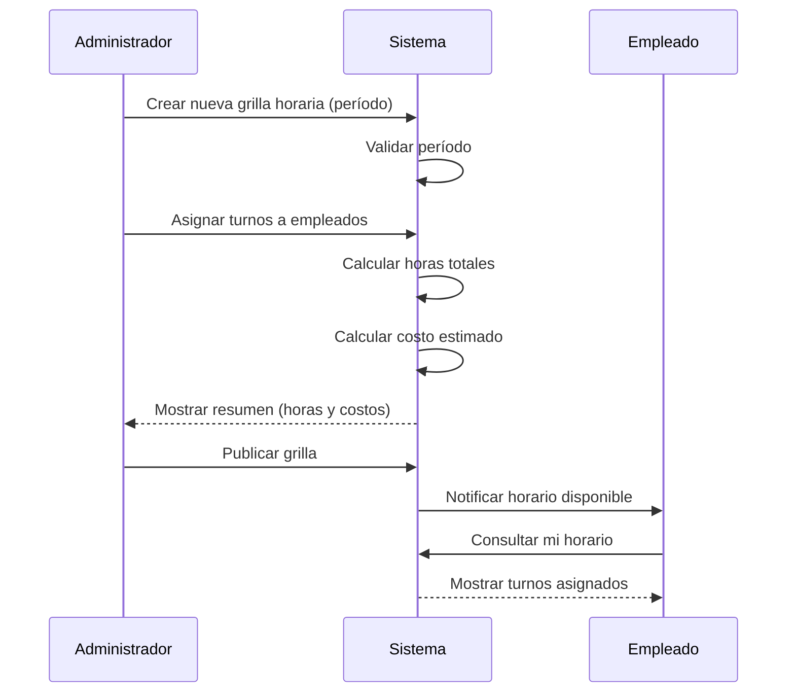
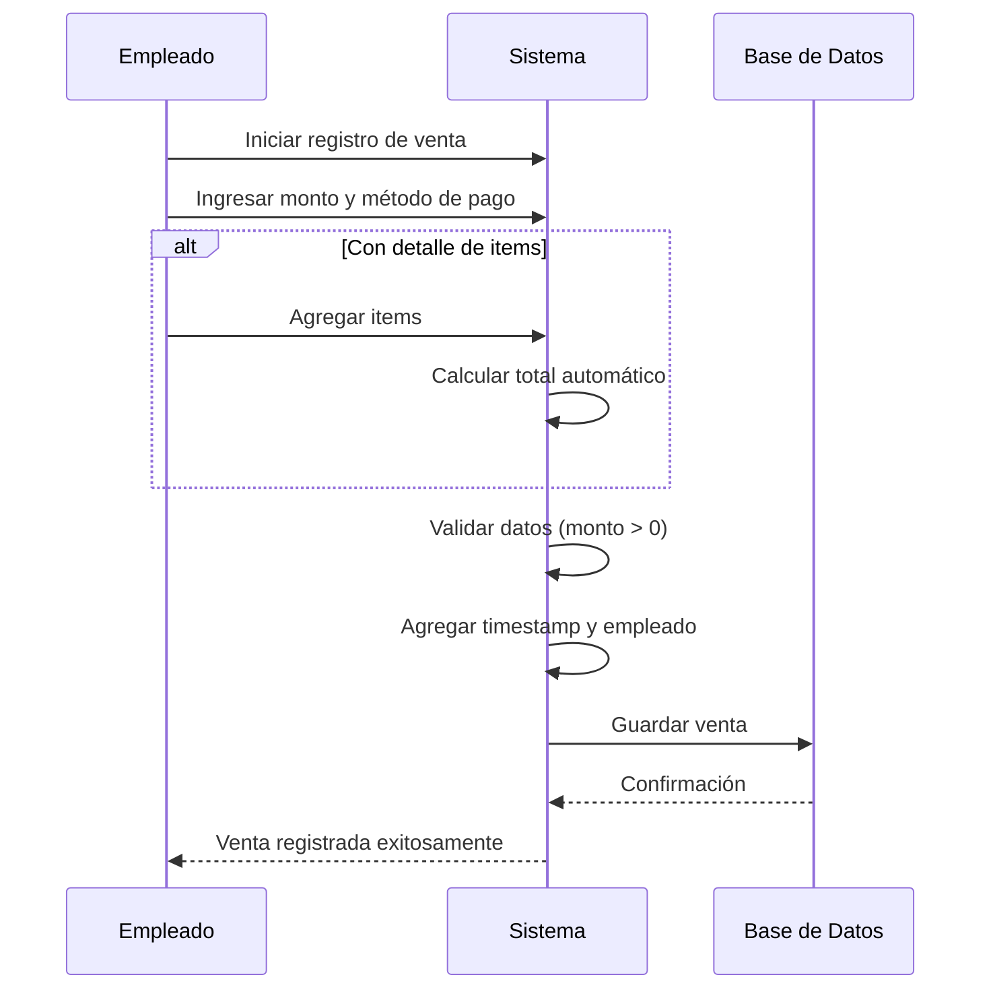
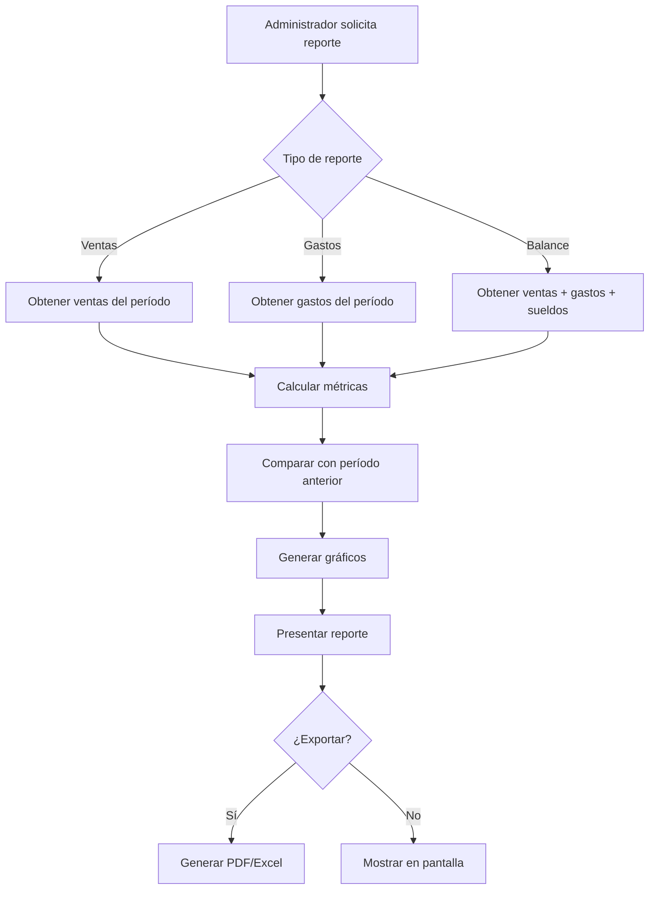
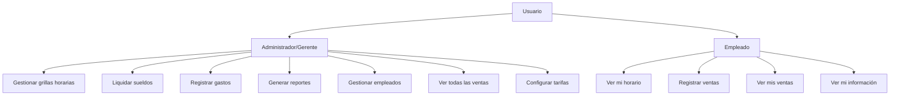

# Feature Specification: Sistema de Gestión para Cafetería

**Created**: 2026-02-04  

## User Scenarios & Testing *(mandatory)*

### User Story 1 - Gestión de Grilla Horaria del Personal (Priority: P1)

Como **administrador/gerente**, necesito crear y gestionar la grilla horaria de mis empleados para planificar la cobertura del local y calcular los costos de personal asociados.

**Why this priority**: Es la funcionalidad más crítica identificada. Permite planificar la operación del negocio y calcular el costo de personal, que es fundamental para la toma de decisiones y la liquidación de sueldos.

**Independent Test**: Puede ser completamente testeado creando una grilla horaria para una semana, asignando empleados a turnos, y verificando que el sistema calcule correctamente las horas totales y el costo estimado de sueldos.

**Mejoras Identificadas**:
- **NUEVO**: El sistema debe mostrar el horario de trabajo del local en la vista de armado de grilla
- **NUEVO**: Debe permitir configurar horarios de trabajo por local (soporte multi-local)
- **NUEVO**: La sumatoria de horas debe calcularse en tiempo real mientras se agregan turnos
- **NUEVO**: Los costos deben calcularse en tiempo real mientras se agregan turnos
- **NUEVO**: Debe mostrar empleados en vacaciones para evitar asignaciones incorrectas
- **NUEVO**: Debe permitir ver/imprimir la grilla en formato calendario
- **NUEVO**: Los nombres de empleados deben permanecer visibles al hacer scroll horizontal

**Acceptance Scenarios**:

1. **Scenario**: Crear grilla horaria semanal
   - **Given** soy un administrador autenticado con empleados registrados en el sistema
   - **When** creo una nueva grilla para la semana del 10/02/2026 y asigno turnos a diferentes empleados
   - **Then** el sistema guarda la grilla, muestra un resumen de horas por empleado, y calcula el costo total estimado
   - **AND** veo el horario de trabajo del local como referencia
   - **AND** la sumatoria de horas se actualiza en tiempo real
   - **AND** los costos se calculan automáticamente mientras agrego turnos

2. **Scenario**: Modificar grilla existente
   - **Given** existe una grilla horaria para la próxima semana
   - **When** cambio el turno de un empleado o agrego/elimino turnos
   - **Then** el sistema actualiza la grilla, recalcula las horas y costos, y notifica los cambios
   - **AND** los nombres de empleados permanecen visibles al hacer scroll horizontal

3. **Scenario**: Visualizar costo de personal por período
   - **Given** tengo grillas horarias creadas para múltiples semanas
   - **When** consulto el costo de personal del último mes
   - **Then** el sistema muestra el total de horas trabajadas y el costo total de sueldos del período

4. **Scenario**: Ver empleados en vacaciones
   - **Given** estoy armando una grilla horaria
   - **When** intento asignar un turno
   - **Then** veo claramente qué empleados están de vacaciones en ese período
   - **AND** el sistema me alerta si intento asignar a alguien de vacaciones

5. **Scenario**: Exportar grilla en formato calendario
   - **Given** tengo una grilla horaria completa
   - **When** selecciono ver/imprimir en formato calendario
   - **Then** veo la grilla en formato calendario visual
   - **AND** puedo imprimirla o exportarla

6. **Scenario**: Configurar horario del local
   - **Given** soy administrador
   - **When** configuro el horario de trabajo del local (ej: Lun-Vie 8-20, Sáb-Dom 9-22)
   - **Then** este horario se muestra como referencia al armar grillas
   - **AND** puedo configurar diferentes horarios para múltiples locales

---

### User Story 2 - Consulta de Horario por Empleado (Priority: P1)

Como **empleado**, necesito ver mi horario asignado para saber cuándo debo trabajar en el próximo período (semana/mes).

**Why this priority**: Es crítico para la operación diaria. Los empleados necesitan conocer sus turnos para organizarse, y esto reduce consultas al gerente.

**Independent Test**: Un empleado puede autenticarse, ver su grilla horaria de la próxima semana/mes, y confirmar sus turnos asignados.

**Acceptance Scenarios**:

1. **Scenario**: Empleado consulta su horario semanal
   - **Given** soy un empleado autenticado y el gerente ha creado la grilla de la próxima semana
   - **When** accedo a la sección "Mi Horario"
   - **Then** veo mis turnos asignados con día, hora de entrada, hora de salida, y total de horas semanales

2. **Scenario**: Empleado consulta horario mensual
   - **Given** existen grillas creadas para las próximas 4 semanas
   - **When** selecciono vista mensual
   - **Then** veo un calendario con todos mis turnos del mes y el total de horas mensuales

3. **Scenario**: Notificación de cambios en horario
   - **Given** tengo turnos asignados para la próxima semana
   - **When** el gerente modifica mi horario
   - **Then** recibo una notificación indicando los cambios realizados

---

### User Story 3 - Registro de Ventas (Priority: P1)

Como **empleado**, necesito registrar las ventas realizadas durante mi turno para llevar el control de ingresos del negocio.

**Why this priority**: Es fundamental para el core del negocio. Sin registro de ventas no hay datos para análisis, reportes ni toma de decisiones.

**Independent Test**: Un empleado puede registrar una venta con items y monto, y el sistema la almacena correctamente con timestamp y usuario que la registró.

**Acceptance Scenarios**:

1. **Scenario**: Registrar venta simple
   - **Given** soy un empleado autenticado en turno
   - **When** registro una venta de $5,000 con método de pago "Efectivo"
   - **Then** el sistema guarda la venta con fecha/hora, empleado, monto y método de pago

2. **Scenario**: Registrar venta con detalle de items
   - **Given** estoy registrando una nueva venta
   - **When** agrego items (ej: 2 cafés, 1 medialunas) con sus precios
   - **Then** el sistema calcula el total automáticamente y guarda el detalle completo

3. **Scenario**: Consultar ventas de mi turno
   - **Given** he registrado varias ventas durante mi turno
   - **When** consulto el resumen de mi turno actual
   - **Then** veo la lista de ventas, total recaudado, y cantidad de transacciones

---

### User Story 4 - Liquidación de Sueldos (Priority: P2)

Como **administrador/gerente**, necesito calcular y liquidar los sueldos de mis empleados basándome en las horas trabajadas registradas en las grillas horarias.

**Why this priority**: Es una necesidad operativa mensual crítica, pero puede realizarse manualmente el primer mes mientras se implementan las funcionalidades P1.

**Independent Test**: El administrador puede seleccionar un período, ver las horas trabajadas por cada empleado, aplicar tarifas horarias, y generar el cálculo de sueldo.

**Acceptance Scenarios**:

1. **Scenario**: Calcular sueldo mensual de un empleado
   - **Given** tengo grillas horarias completas del último mes para un empleado
   - **When** selecciono el empleado y el período (ej: Enero 2026)
   - **Then** el sistema muestra total de horas trabajadas, tarifa horaria, y sueldo bruto calculado

2. **Scenario**: Liquidar sueldos de todo el personal
   - **Given** es fin de mes y todas las grillas están completas
   - **When** ejecuto la liquidación mensual
   - **Then** el sistema genera un reporte con el sueldo de cada empleado y el costo total de personal

3. **Scenario**: Ajustar tarifa horaria de empleado
   - **Given** un empleado tiene una tarifa horaria configurada
   - **When** modifico su tarifa (ej: por aumento)
   - **Then** el sistema aplica la nueva tarifa para cálculos futuros y mantiene histórico de tarifas

---

### User Story 5 - Registro y Control de Gastos (Priority: P2)

Como **administrador/gerente**, necesito registrar todos los gastos del negocio (insumos, servicios, etc.) para controlar los egresos y calcular rentabilidad.

**Why this priority**: Es esencial para el control financiero, pero puede manejarse con planillas el primer mes mientras se priorizan funcionalidades de personal y ventas.

**Independent Test**: El administrador puede registrar un gasto con categoría, monto, fecha y descripción, y consultar el total de gastos por período.

**Acceptance Scenarios**:

1. **Scenario**: Registrar gasto de insumos
   - **Given** soy administrador autenticado
   - **When** registro un gasto de $15,000 en categoría "Café en grano" con fecha y proveedor
   - **Then** el sistema guarda el gasto y lo incluye en el total de egresos

2. **Scenario**: Categorizar gastos
   - **Given** estoy registrando un nuevo gasto
   - **When** selecciono una categoría (Insumos, Servicios, Mantenimiento, Personal, Otros)
   - **Then** el sistema asocia el gasto a esa categoría para reportes posteriores

3. **Scenario**: Consultar gastos por período y categoría
   - **Given** tengo múltiples gastos registrados
   - **When** filtro por categoría "Insumos" y período "Enero 2026"
   - **Then** veo todos los gastos de esa categoría en ese período con el total

---

### User Story 6 - Reportes y Análisis de Ventas (Priority: P2)

Como **administrador/gerente**, necesito generar reportes de ventas por período (semanal/mensual/trimestral) para analizar la evolución del negocio y comparar con períodos anteriores.

**Why this priority**: Es fundamental para la toma de decisiones, pero requiere primero tener datos de ventas registrados (P1).

**Independent Test**: El administrador puede generar un reporte mensual que muestre total de ventas, comparación con mes anterior, y gráficos de evolución.

**Acceptance Scenarios**:

1. **Scenario**: Generar reporte mensual de ventas
   - **Given** tengo ventas registradas de los últimos 3 meses
   - **When** genero el reporte de Enero 2026
   - **Then** veo total de ventas, cantidad de transacciones, ticket promedio, y comparación con Diciembre 2025

2. **Scenario**: Comparar ventas entre períodos
   - **Given** existen datos de ventas de múltiples meses
   - **When** comparo Q1 2026 vs Q4 2025
   - **Then** veo la variación porcentual, gráfico de evolución, y análisis de tendencia

3. **Scenario**: Reporte de ventas por empleado
   - **Given** múltiples empleados han registrado ventas
   - **When** genero reporte mensual por empleado
   - **Then** veo el total vendido por cada empleado y su contribución al total

---

### User Story 7 - Balance y Análisis Financiero (Priority: P3)

Como **administrador/gerente**, necesito generar balances que muestren ingresos (ventas) vs egresos (gastos + sueldos) para conocer la rentabilidad del negocio.

**Why this priority**: Es importante para la salud financiera, pero requiere que estén implementadas las funcionalidades de ventas, gastos y sueldos primero.

**Independent Test**: El administrador puede generar un balance mensual que muestre ingresos totales, egresos totales, y resultado neto (ganancia/pérdida).

**Acceptance Scenarios**:

1. **Scenario**: Generar balance mensual
   - **Given** tengo registros completos de ventas, gastos y sueldos de Enero 2026
   - **When** genero el balance del mes
   - **Then** veo ingresos totales, egresos por categoría (sueldos, insumos, servicios, etc.), y resultado neto

2. **Scenario**: Balance histórico comparativo
   - **Given** tengo balances de los últimos 6 meses
   - **When** consulto la evolución histórica
   - **Then** veo un gráfico de evolución de ingresos, egresos y resultado neto mes a mes

3. **Scenario**: Análisis de rentabilidad
   - **Given** tengo datos de múltiples períodos
   - **When** solicito análisis de rentabilidad
   - **Then** veo margen de ganancia porcentual, punto de equilibrio, y tendencias

---

### User Story 8 - Seguimiento de Evolución de Precios de Insumos (Priority: P3)

Como **administrador/gerente**, necesito registrar y hacer seguimiento de la evolución de precios de mis insumos principales para tomar decisiones sobre ajustes de precios de venta.

**Why this priority**: Es útil para la gestión estratégica, pero no es crítico para la operación diaria inicial.

**Independent Test**: El administrador puede registrar el precio de un insumo en diferentes fechas y ver un gráfico de evolución de precios.

**Acceptance Scenarios**:

1. **Scenario**: Registrar precio de insumo
   - **Given** compro café en grano a un nuevo precio
   - **When** registro el insumo "Café en grano" a $8,000/kg en la fecha actual
   - **Then** el sistema guarda el precio con timestamp para histórico

2. **Scenario**: Ver evolución de precio de insumo
   - **Given** tengo múltiples registros de precio del mismo insumo
   - **When** consulto la evolución del "Café en grano"
   - **Then** veo un gráfico con la evolución de precios y porcentaje de variación

3. **Scenario**: Alerta de aumento significativo
   - **Given** tengo histórico de precios de un insumo
   - **When** registro un precio con aumento mayor al 20% respecto al anterior
   - **Then** el sistema me alerta sobre el aumento significativo

---

### Edge Cases

- ¿Qué pasa si un empleado no puede cumplir su turno asignado? ¿Hay un sistema de reemplazo o notificación?
- ¿Cómo se manejan las horas extras o turnos fuera de lo planificado?
- ¿Qué sucede si se registra una venta con monto negativo o cero?
- ¿Cómo se corrigen errores en ventas ya registradas?
- ¿Qué pasa si se intenta liquidar sueldos sin tener todas las grillas horarias completas del período?
- ¿Cómo se manejan los gastos recurrentes (ej: alquiler mensual)?
- ¿Qué sucede si se elimina un empleado que tiene turnos asignados en el futuro?
- ¿Cómo se manejan los diferentes métodos de pago en las ventas (efectivo, tarjeta, transferencia)?
- ¿Hay límites de acceso por horario para los empleados (solo pueden registrar ventas durante su turno)?
- **CRÍTICO**: ¿Cómo prevenir que empleados accedan a módulos restringidos mediante URLs directas?
- **CRÍTICO**: ¿Cómo asegurar que el backend valide permisos en todas las rutas, no solo el frontend?

## Requirements *(mandatory)*

### Functional Requirements

#### Autenticación y Usuarios
- **FR-001**: Sistema DEBE permitir autenticación de usuarios con email y contraseña
- **FR-002**: Sistema DEBE diferenciar entre roles de usuario: Administrador/Gerente y Empleado
- **FR-003**: Sistema DEBE permitir al administrador crear, modificar y desactivar cuentas de empleados
- **FR-004**: Empleados DEBEN poder ver únicamente su información personal y horarios asignados
- **FR-005**: Administradores DEBEN tener acceso completo a todas las funcionalidades del sistema

#### Gestión de Grilla Horaria
- **FR-006**: Sistema DEBE permitir crear grillas horarias por semana, mes o período personalizado
- **FR-007**: Sistema DEBE permitir asignar turnos a empleados con hora de inicio y hora de fin
- **FR-008**: Sistema DEBE calcular automáticamente las horas totales por empleado en cada período
- **FR-009**: Sistema DEBE calcular el costo estimado de sueldos basado en horas y tarifa horaria
- **FR-010**: Sistema DEBE permitir modificar grillas existentes y mantener histórico de cambios
- **FR-011**: Empleados DEBEN poder visualizar sus horarios asignados para períodos futuros
- **FR-012**: Sistema DEBE notificar a empleados cuando se modifique su horario
- **FR-013**: Sistema DEBE mostrar el horario de trabajo del local en la vista de armado de grilla
- **FR-014**: Sistema DEBE permitir configurar horarios de trabajo por local (multi-local)
- **FR-015**: Sistema DEBE calcular y mostrar en tiempo real la sumatoria de horas mientras se agregan turnos
- **FR-016**: Sistema DEBE calcular y mostrar en tiempo real los costos mientras se agregan turnos
- **FR-017**: Sistema DEBE mostrar visualmente qué empleados están de vacaciones en el período
- **FR-018**: Sistema DEBE permitir exportar/imprimir grilla en formato calendario
- **FR-019**: Sistema DEBE mantener nombres de empleados visibles al hacer scroll horizontal (columna fija)
- **FR-020**: Sistema DEBE filtrar empleados inactivos de las opciones de asignación de turnos

#### Registro de Ventas
- **FR-013**: Sistema DEBE permitir a empleados registrar ventas con monto y método de pago
- **FR-014**: Sistema DEBE registrar automáticamente fecha, hora y empleado que registra cada venta
- **FR-015**: Sistema DEBE permitir agregar detalle de items a cada venta (opcional)
- **FR-016**: Sistema DEBE calcular totales automáticamente cuando se agregan items
- **FR-017**: Sistema DEBE permitir consultar ventas por período, empleado y método de pago
- **FR-018**: Sistema DEBE validar que los montos de venta sean positivos y mayores a cero

#### Liquidación de Sueldos
- **FR-019**: Sistema DEBE calcular sueldos basándose en horas trabajadas según grillas horarias
- **FR-020**: Sistema DEBE permitir configurar tarifa horaria por empleado
- **FR-021**: Sistema DEBE mantener histórico de tarifas horarias por empleado
- **FR-022**: Sistema DEBE generar reporte de liquidación mensual con detalle por empleado
- **FR-023**: Sistema DEBE calcular el costo total de personal por período

#### Gestión de Gastos
- **FR-024**: Sistema DEBE permitir registrar gastos con monto, fecha, categoría y descripción
- **FR-025**: Sistema DEBE soportar categorías de gastos: Insumos, Servicios, Mantenimiento, Personal, Otros
- **FR-026**: Sistema DEBE permitir consultar gastos por período y categoría
- **FR-027**: Sistema DEBE calcular totales de gastos por categoría y período
- **FR-028**: Sistema DEBE permitir adjuntar información de proveedor a cada gasto

#### Reportes y Análisis
- **FR-029**: Sistema DEBE generar reportes de ventas por período (semanal, mensual, trimestral)
- **FR-030**: Sistema DEBE comparar ventas entre diferentes períodos
- **FR-031**: Sistema DEBE calcular métricas: total de ventas, cantidad de transacciones, ticket promedio
- **FR-032**: Sistema DEBE generar reportes de ventas por empleado
- **FR-033**: Sistema DEBE generar balances financieros (ingresos vs egresos)
- **FR-034**: Sistema DEBE mostrar resultado neto (ganancia/pérdida) por período
- **FR-035**: Sistema DEBE generar gráficos de evolución de ventas, gastos y rentabilidad
- **FR-036**: Sistema DEBE permitir exportar reportes en formato PDF o Excel

#### Seguimiento de Insumos
- **FR-037**: Sistema DEBE permitir registrar precios de insumos con fecha
- **FR-038**: Sistema DEBE mantener histórico de precios por insumo
- **FR-039**: Sistema DEBE mostrar evolución de precios de insumos en gráficos
- **FR-040**: Sistema DEBE calcular variación porcentual de precios entre períodos

#### Persistencia y Seguridad
- **FR-041**: Sistema DEBE persistir todos los datos de forma segura y confiable
- **FR-042**: Sistema DEBE realizar backups automáticos de la base de datos
- **FR-043**: Sistema DEBE registrar logs de auditoría para operaciones críticas (ventas, liquidaciones, cambios de grilla)
- **FR-044**: Sistema DEBE proteger información sensible (contraseñas, datos financieros)
- **FR-045**: **CRÍTICO** - Sistema DEBE validar permisos en BACKEND para todas las rutas, no solo ocultar elementos del frontend
- **FR-046**: **CRÍTICO** - Empleados NO deben poder acceder a ventas/gastos/nóminas/horarios/reportes mediante URLs directas
- **FR-047**: Sistema DEBE retornar error 403 (Forbidden) cuando un usuario sin permisos intenta acceder a recursos restringidos
- **FR-048**: Sistema DEBE implementar middleware de autorización en todas las rutas protegidas del backend

### Key Entities

- **Usuario**: Representa a las personas que usan el sistema. Atributos: nombre, email, contraseña (encriptada), rol (Administrador/Empleado), estado (activo/inactivo), fecha de creación.

- **Empleado**: Extiende Usuario con información laboral. Atributos: tarifa horaria actual, fecha de ingreso, histórico de tarifas, relación con Usuario.

- **Grilla Horaria**: Representa la planificación de turnos. Atributos: período (fecha inicio, fecha fin), estado (borrador/publicada), fecha de creación, creador, total_horas_calculadas, costo_total_estimado.

- **Turno**: Representa un turno asignado a un empleado. Atributos: empleado asignado, fecha, hora inicio, hora fin, horas totales, costo_estimado, relación con Grilla Horaria.

- **Horario de Local**: Configuración de horarios de trabajo. Atributos: local_id, nombre_local, días_semana, hora_apertura, hora_cierre, es_activo.

- **Período de Vacaciones**: Registra vacaciones de empleados. Atributos: empleado_id, fecha_inicio, fecha_fin, estado (solicitado/aprobado/rechazado), notas.

- **Venta**: Representa una transacción de venta. Atributos: monto total, método de pago, fecha y hora, empleado que registró, estado, notas.

- **Item de Venta**: Detalle de productos/servicios vendidos. Atributos: descripción, cantidad, precio unitario, subtotal, relación con Venta.

- **Gasto**: Representa un egreso del negocio. Atributos: monto, fecha, categoría, descripción, proveedor, comprobante, creador.

- **Categoría de Gasto**: Clasificación de gastos. Atributos: nombre, descripción, estado (activa/inactiva).

- **Insumo**: Productos que se compran para el negocio. Atributos: nombre, unidad de medida, categoría, estado.

- **Precio de Insumo**: Histórico de precios. Atributos: insumo, precio, fecha de registro, proveedor, notas.

- **Liquidación**: Cálculo de sueldos por período. Atributos: empleado, período (mes/año), horas trabajadas, tarifa aplicada, sueldo bruto, fecha de generación.

- **Reporte**: Reportes generados. Atributos: tipo (ventas/balance/gastos), período, fecha de generación, parámetros, datos calculados.

## Success Criteria *(mandatory)*

### Measurable Outcomes

- **SC-001**: Administrador puede crear una grilla horaria semanal completa en menos de 10 minutos
- **SC-002**: Empleados pueden consultar su horario del próximo mes en menos de 30 segundos
- **SC-003**: Registro de una venta toma menos de 1 minuto desde inicio hasta confirmación
- **SC-004**: Liquidación mensual de sueldos de 10 empleados se completa en menos de 5 minutos
- **SC-005**: Generación de reporte mensual de ventas toma menos de 10 segundos
- **SC-006**: Sistema mantiene 100% de precisión en cálculos de horas, sueldos y totales financieros
- **SC-007**: 90% de los empleados pueden usar el sistema sin capacitación adicional después de una demostración de 15 minutos
- **SC-008**: Administrador puede generar un balance mensual completo en menos de 2 minutos
- **SC-009**: Sistema soporta registro de al menos 500 ventas por día sin degradación de performance
- **SC-010**: Tiempo de respuesta de cualquier consulta o reporte es menor a 3 segundos
- **SC-011**: Reducción del 80% en tiempo dedicado a gestión manual de horarios y liquidaciones
- **SC-012**: 100% de los datos críticos (ventas, gastos, horarios) son respaldados automáticamente cada 24 horas

### Mermaid Diagrams

#### Flujo de Gestión de Grilla Horaria

#### Flujo de Registro de Venta

#### Flujo de Generación de Reportes

#### Arquitectura de Roles y Permisos

