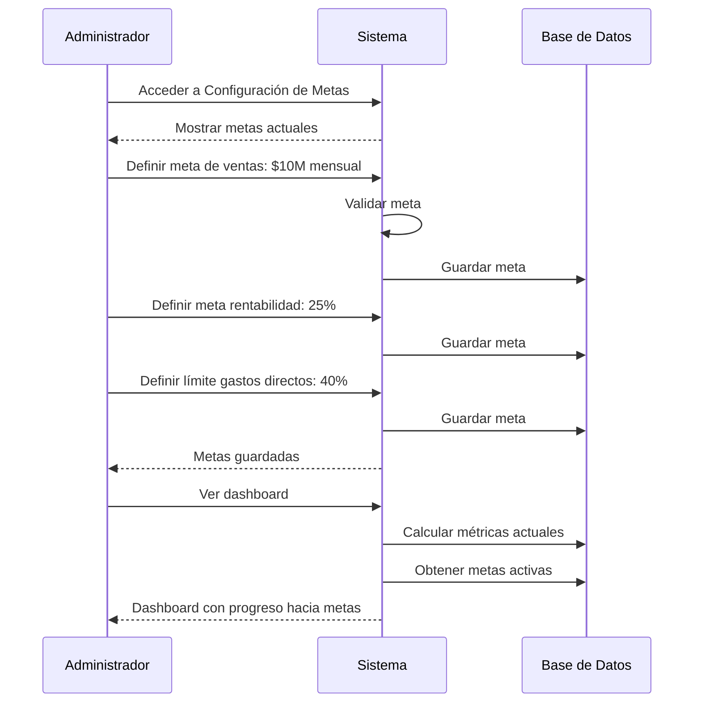
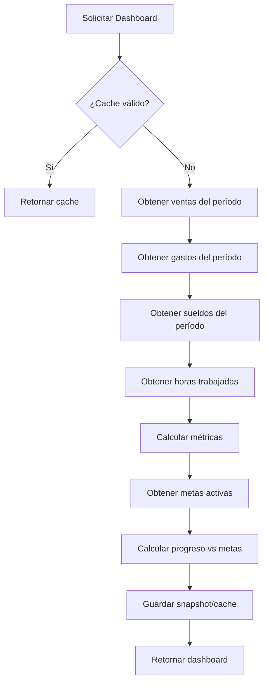
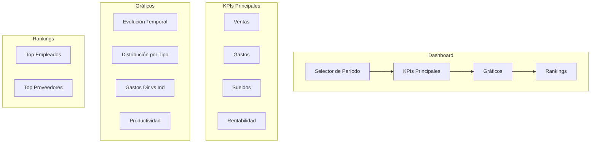

# Especificación del Módulo de Reportes y Dashboard

**Fecha de Creación**: 2026-02-14  
**Prioridad**: P2 (Requiere datos de ventas, gastos y empleados)

## Resumen Ejecutivo

El módulo de reportes proporciona un dashboard analítico que permite cruzar datos de ventas, gastos, sueldos y horas trabajadas. Incluye la configuración de **metas alcanzables** (KPIs) para medir el rendimiento del negocio en términos de ventas, rentabilidad, productividad y control de gastos.

---

## User Scenarios & Testing

### User Story 1 - Dashboard Principal con Métricas Clave (Priority: P1)

Como **administrador/gerente**, necesito ver un dashboard con las métricas principales del negocio en tiempo real para tomar decisiones informadas rápidamente.

**Why this priority**: Es la funcionalidad central del módulo. Sin un dashboard consolidado, el análisis de datos requiere revisar múltiples secciones manualmente.

**Independent Test**: El administrador puede acceder al dashboard y ver métricas de ventas, gastos, sueldos y rentabilidad del período actual vs período anterior.

**Acceptance Scenarios**:

1. **Scenario**: Ver resumen del día actual
   - **Given** soy administrador autenticado con datos registrados
   - **When** accedo al dashboard
   - **Then** veo ventas del día, gastos del día, y comparación con el mismo día de la semana anterior

2. **Scenario**: Ver resumen del mes
   - **Given** tengo datos de ventas, gastos y sueldos del mes
   - **When** selecciono vista mensual en el dashboard
   - **Then** veo totales del mes, progreso vs meta, y comparación con mes anterior

3. **Scenario**: Ver indicadores de rentabilidad
   - **Given** tengo datos de ingresos y egresos completos
   - **When** visualizo el panel de rentabilidad
   - **Then** veo margen bruto, margen neto, y tendencia de los últimos 6 meses

---

### User Story 2 - Configuración de Metas Alcanzables (Priority: P1)

Como **administrador/gerente**, necesito configurar metas (alcanzables) para ventas, rentabilidad, productividad y gastos, para medir el desempeño del negocio contra objetivos definidos.

**Why this priority**: Las metas son fundamentales para dar contexto a los números. Sin ellas, los datos son solo información sin objetivo de comparación.

**Independent Test**: El administrador puede configurar metas por período y ver el progreso hacia cada meta en el dashboard.

**Acceptance Scenarios**:

1. **Scenario**: Configurar meta de ventas
   - **Given** soy administrador en la sección de configuración
   - **When** defino meta de ventas mensual de $10,000,000
   - **Then** el sistema guarda la meta y muestra progreso en el dashboard

2. **Scenario**: Configurar meta de rentabilidad
   - **Given** quiero definir un objetivo de margen
   - **When** configuro meta de rentabilidad del 25%
   - **Then** el dashboard muestra el margen actual vs la meta con indicador visual

3. **Scenario**: Configurar meta de gastos
   - **Given** quiero controlar los gastos directos e indirectos
   - **When** configuro límites de gastos directos (40% de ventas) e indirectos (15% de ventas)
   - **Then** el dashboard alerta cuando los gastos superan los límites

4. **Scenario**: Configurar meta de productividad
   - **Given** quiero medir eficiencia del personal
   - **When** configuro meta de ventas por hora trabajada ($15,000/hora)
   - **Then** el dashboard muestra productividad actual vs meta

---

### User Story 3 - Análisis de Ventas Detallado (Priority: P1)

Como **administrador/gerente**, necesito analizar las ventas por diferentes dimensiones (período, empleado, tipo de venta, medio de pago, sala/mesa) para identificar patrones y oportunidades.

**Why this priority**: El análisis de ventas es esencial para entender qué funciona y qué no en el negocio.

**Independent Test**: El administrador puede filtrar y agrupar ventas por múltiples criterios y ver gráficos de evolución.

**Acceptance Scenarios**:

1. **Scenario**: Análisis por tipo de venta
   - **Given** tengo ventas de Local, Mostrador y Delivery
   - **When** genero reporte por tipo de venta
   - **Then** veo distribución porcentual y montos por cada tipo

2. **Scenario**: Análisis por medio de pago
   - **Given** tengo ventas en Efectivo, Mercado Pago y Pedidos Ya
   - **When** analizo por medio de pago
   - **Then** veo totales y porcentajes por cada medio

3. **Scenario**: Análisis por empleado/camarero
   - **Given** tengo ventas registradas por diferentes empleados
   - **When** genero reporte por vendedor
   - **Then** veo ranking de ventas por empleado y ticket promedio

4. **Scenario**: Análisis por sala/mesa
   - **Given** tengo ventas de diferentes salas (Salón, Patio, Frente)
   - **When** analizo por sala
   - **Then** veo rendimiento de cada zona del local

---

### User Story 4 - Análisis de Gastos por Categoría (Priority: P2)

Como **administrador/gerente**, necesito analizar los gastos clasificados en directos e indirectos, por proveedor y por categoría para optimizar costos.

**Why this priority**: El control de gastos es fundamental para la rentabilidad, pero requiere primero tener los gastos categorizados correctamente.

**Independent Test**: El administrador puede ver desglose de gastos por categoría, distinguiendo entre directos e indirectos.

**Acceptance Scenarios**:

1. **Scenario**: Ver gastos directos vs indirectos
   - **Given** tengo gastos registrados con categorías
   - **When** accedo al análisis de gastos
   - **Then** veo total de gastos directos (mercadería, insumos) e indirectos (alquiler, servicios, contadora)

2. **Scenario**: Análisis por proveedor
   - **Given** tengo múltiples gastos de diferentes proveedores
   - **When** genero reporte por proveedor
   - **Then** veo ranking de proveedores por monto total y frecuencia

3. **Scenario**: Evolución de gastos
   - **Given** tengo histórico de gastos
   - **When** consulto evolución mensual
   - **Then** veo gráfico de tendencia de gastos por categoría

---

### User Story 5 - Análisis de Productividad Laboral (Priority: P2)

Como **administrador/gerente**, necesito analizar la relación entre horas trabajadas, sueldos pagados y ventas generadas para medir la productividad del equipo.

**Why this priority**: Optimizar la productividad laboral impacta directamente en la rentabilidad.

**Independent Test**: El administrador puede ver métricas de productividad cruzando datos de ventas, horas y sueldos.

**Acceptance Scenarios**:

1. **Scenario**: Ver ventas por hora trabajada
   - **Given** tengo registros de ventas y grillas horarias
   - **When** consulto productividad
   - **Then** veo ratio de ventas / hora trabajada por período

2. **Scenario**: Costo laboral vs ventas
   - **Given** tengo datos de sueldos y ventas
   - **When** analizo costo laboral
   - **Then** veo porcentaje de sueldos sobre ventas y comparación con meta

3. **Scenario**: Productividad por empleado
   - **Given** tengo ventas asociadas a empleados y sus horas trabajadas
   - **When** genero reporte de productividad individual
   - **Then** veo ranking de empleados por ventas/hora con ticket promedio

---

### User Story 6 - Balance y Rentabilidad (Priority: P2)

Como **administrador/gerente**, necesito ver un balance completo de ingresos vs egresos para conocer la rentabilidad real del negocio.

**Why this priority**: Es la métrica final que resume la salud financiera del negocio.

**Independent Test**: El administrador puede generar un balance que muestre ingresos, todos los tipos de egresos, y resultado neto.

**Acceptance Scenarios**:

1. **Scenario**: Balance mensual completo
   - **Given** tengo registros completos del mes
   - **When** genero balance mensual
   - **Then** veo:
     - Ingresos: Ventas totales
     - Egresos: Gastos directos + Gastos indirectos + Sueldos
     - Resultado neto y margen de rentabilidad

2. **Scenario**: Comparación entre períodos
   - **Given** tengo datos de múltiples meses
   - **When** comparo dos períodos
   - **Then** veo variación porcentual de cada línea del balance

3. **Scenario**: Proyección del mes
   - **Given** es mitad de mes y tengo datos parciales
   - **When** solicito proyección
   - **Then** el sistema proyecta resultado del mes basado en tendencia

---

### User Story 7 - Exportación de Reportes (Priority: P3)

Como **administrador/gerente**, necesito exportar reportes en diferentes formatos para compartir con socios o contadores.

**Why this priority**: La exportación es útil pero no crítica para el uso diario del sistema.

**Independent Test**: El administrador puede exportar cualquier reporte en PDF o Excel.

**Acceptance Scenarios**:

1. **Scenario**: Exportar a PDF
   - **Given** tengo un reporte generado
   - **When** selecciono exportar a PDF
   - **Then** se descarga un PDF formateado con el reporte

2. **Scenario**: Exportar a Excel
   - **Given** tengo un reporte con datos tabulares
   - **When** selecciono exportar a Excel
   - **Then** se descarga un archivo Excel con los datos

---

### Edge Cases

- ¿Qué pasa si no hay datos para el período seleccionado?
- ¿Cómo se manejan los gastos sin categoría asignada?
- ¿Qué ocurre si faltan grillas horarias para calcular productividad?
- ¿Cómo se calculan las metas cuando hay días sin operación (feriados, vacaciones)?
- ¿Cómo se manejan las ventas anuladas o canceladas en los reportes?
- ¿Qué pasa si un empleado no tiene ventas asociadas (trabaja en cocina)?

---

## Requirements

### Functional Requirements

#### Dashboard Principal
- **FR-RP-001**: Sistema DEBE mostrar panel de resumen con métricas clave del período seleccionado
- **FR-RP-002**: Sistema DEBE permitir cambiar período de visualización (hoy, semana, mes, trimestre, año, personalizado)
- **FR-RP-003**: Sistema DEBE mostrar comparación con período anterior (variación %)
- **FR-RP-004**: Sistema DEBE mostrar progreso hacia metas configuradas con indicadores visuales
- **FR-RP-005**: Sistema DEBE actualizar métricas en tiempo real o con opción de refresh

#### Configuración de Metas (Alcanzables)
- **FR-RP-006**: Sistema DEBE permitir configurar meta de ventas por período (diaria, semanal, mensual)
- **FR-RP-007**: Sistema DEBE permitir configurar meta de rentabilidad (% de margen bruto/neto)
- **FR-RP-008**: Sistema DEBE permitir configurar límite de gastos directos (% sobre ventas o monto fijo)
- **FR-RP-009**: Sistema DEBE permitir configurar límite de gastos indirectos (% sobre ventas o monto fijo)
- **FR-RP-010**: Sistema DEBE permitir configurar meta de productividad (ventas/hora trabajada)
- **FR-RP-011**: Sistema DEBE guardar histórico de metas para análisis retrospectivo
- **FR-RP-012**: Sistema DEBE alertar visualmente cuando una métrica está por debajo de la meta

#### Análisis de Ventas
- **FR-RP-013**: Sistema DEBE permitir filtrar ventas por fecha, empleado, tipo de venta, medio de pago, sala
- **FR-RP-014**: Sistema DEBE generar gráfico de evolución de ventas (línea temporal)
- **FR-RP-015**: Sistema DEBE mostrar distribución de ventas por tipo (pie chart)
- **FR-RP-016**: Sistema DEBE calcular ticket promedio, cantidad de transacciones, ventas por hora
- **FR-RP-017**: Sistema DEBE mostrar ranking de productos más vendidos (si hay detalle de items)
- **FR-RP-018**: Sistema DEBE mostrar ranking de empleados por ventas

#### Análisis de Gastos
- **FR-RP-019**: Sistema DEBE clasificar gastos en directos e indirectos automáticamente según categoría
- **FR-RP-020**: Sistema DEBE permitir definir qué categorías son gastos directos vs indirectos
- **FR-RP-021**: Sistema DEBE mostrar evolución de gastos por categoría
- **FR-RP-022**: Sistema DEBE mostrar top proveedores por monto
- **FR-RP-023**: Sistema DEBE calcular ratio gastos/ventas

#### Análisis de Productividad
- **FR-RP-024**: Sistema DEBE calcular ventas por hora trabajada
- **FR-RP-025**: Sistema DEBE calcular costo laboral como % de ventas
- **FR-RP-026**: Sistema DEBE mostrar productividad por empleado
- **FR-RP-027**: Sistema DEBE comparar productividad actual vs meta vs histórico

#### Balance y Rentabilidad
- **FR-RP-028**: Sistema DEBE generar estado de resultados simplificado
- **FR-RP-029**: Sistema DEBE calcular margen bruto (Ventas - Gastos Directos)
- **FR-RP-030**: Sistema DEBE calcular margen neto (Ventas - Todos los Gastos - Sueldos)
- **FR-RP-031**: Sistema DEBE proyectar resultado del período basado en datos parciales
- **FR-RP-032**: Sistema DEBE mostrar punto de equilibrio estimado

#### Exportación
- **FR-RP-033**: Sistema DEBE permitir exportar cualquier reporte a PDF
- **FR-RP-034**: Sistema DEBE permitir exportar datos a Excel/CSV
- **FR-RP-035**: Sistema DEBE incluir logo y datos del negocio en reportes exportados

---

## Key Entities

### 1. ReportGoal (Meta/Alcanzable)

Representa las metas configurables para medir el rendimiento.

**Atributos**:
- `id`: UUID
- `type`: Tipo de meta (ENUM: 'ventas', 'rentabilidad', 'productividad', 'gastos_directos', 'gastos_indirectos')
- `period_type`: Tipo de período (ENUM: 'diario', 'semanal', 'mensual', 'trimestral', 'anual')
- `target_value`: Valor objetivo (número)
- `target_unit`: Unidad (ENUM: 'monto', 'porcentaje', 'ratio')
- `comparison_type`: Tipo de comparación (ENUM: 'mayor_o_igual', 'menor_o_igual')
- `valid_from`: Fecha desde que aplica
- `valid_to`: Fecha hasta que aplica (NULL = vigente)
- `is_active`: Boolean
- `created_at`: Timestamp
- `created_by_id`: Usuario que creó
- `notes`: Notas adicionales

### 2. ExpenseCategory (Categoría de Gasto)

Clasificación de gastos para distinguir directos de indirectos.

**Atributos**:
- `id`: UUID
- `name`: Nombre de la categoría
- `type`: Tipo (ENUM: 'directo', 'indirecto')
- `description`: Descripción
- `is_active`: Boolean
- `created_at`: Timestamp

**Categorías Predeterminadas**:
- **Directos** (relacionados con producción):
  - Mercadería general
  - Insumos de cocina
  - Materias primas
  
- **Indirectos** (gastos fijos/operativos):
  - Alquiler
  - Servicios (luz, gas, agua)
  - Contadora/Administrativos
  - Marketing/Redes sociales
  - Mantenimiento
  - Químicos/Limpieza

### 3. DashboardSnapshot (Snapshot del Dashboard)

Cache de métricas calculadas para performance.

**Atributos**:
- `id`: UUID
- `date`: Fecha del snapshot
- `period_type`: Tipo de período
- `metrics`: JSON con todas las métricas calculadas
- `created_at`: Timestamp

---

## Métricas y Cálculos

### Métricas de Ventas
```
Total Ventas = SUM(ventas.total) WHERE estado = 'Cerrada'
Ticket Promedio = Total Ventas / Cantidad de Transacciones
Ventas por Hora = Total Ventas / Horas de Operación
Ventas por Empleado = Total Ventas por empleado que registró
```

### Métricas de Gastos
```
Gastos Directos = SUM(gastos) WHERE categoria.type = 'directo'
Gastos Indirectos = SUM(gastos) WHERE categoria.type = 'indirecto'
Ratio Gastos Directos = Gastos Directos / Total Ventas * 100
Ratio Gastos Indirectos = Gastos Indirectos / Total Ventas * 100
```

### Métricas de Productividad
```
Horas Trabajadas = SUM(turnos.horas) del período
Costo Laboral = SUM(sueldos) del período
Ventas por Hora Trabajada = Total Ventas / Horas Trabajadas
Ratio Costo Laboral = Costo Laboral / Total Ventas * 100
```

### Métricas de Rentabilidad
```
Margen Bruto = Total Ventas - Gastos Directos
% Margen Bruto = Margen Bruto / Total Ventas * 100

Margen Neto = Total Ventas - Gastos Directos - Gastos Indirectos - Costo Laboral
% Margen Neto = Margen Neto / Total Ventas * 100

Punto de Equilibrio = (Gastos Fijos) / (1 - (Gastos Variables / Ventas))
```

---

## Interfaz de Usuario

### Dashboard Principal

**Componente**: `ReportsDashboard.jsx`

**Layout**:
```
┌─────────────────────────────────────────────────────────────────┐
│ DASHBOARD DE REPORTES              [Período: v] [🔄 Actualizar]  │
├─────────────────────────────────────────────────────────────────┤
│                                                                 │
│  ┌─────────────┐ ┌─────────────┐ ┌─────────────┐ ┌────────────┐│
│  │ 💰 VENTAS   │ │ 📉 GASTOS   │ │ 👥 SUELDOS  │ │📊RENTABIL. ││
│  │ $2,450,000  │ │ $890,000    │ │ $420,000    │ │   18.5%    ││
│  │ ▲ 12% vs ant│ │ ▼ 5% vs ant │ │ = vs ant    │ │ Meta: 25%  ││
│  │ Meta: 80%✓  │ │ Meta: 35%✓  │ │ Meta: 20%✓  │ │ ⚠️ -6.5%   ││
│  └─────────────┘ └─────────────┘ └─────────────┘ └────────────┘│
│                                                                 │
│  ┌──────────────────────────┐ ┌──────────────────────────────┐ │
│  │ VENTAS POR TIPO          │ │ EVOLUCIÓN MENSUAL            │ │
│  │ [Pie Chart]              │ │ [Line Chart]                 │ │
│  │ 🏪 Local: 65%            │ │                              │ │
│  │ 🛵 Delivery: 25%         │ │  Ventas ─── Gastos ─── Meta  │ │
│  │ 🏧 Mostrador: 10%        │ │                              │ │
│  └──────────────────────────┘ └──────────────────────────────┘ │
│                                                                 │
│  ┌──────────────────────────┐ ┌──────────────────────────────┐ │
│  │ GASTOS: DIRECTOS vs IND. │ │ PRODUCTIVIDAD               │ │
│  │ [Stacked Bar]            │ │                              │ │
│  │ Directos: $580,000 (65%) │ │ Ventas/Hora: $12,500         │ │
│  │ Indirectos: $310,000(35%)│ │ Meta: $15,000 ⚠️             │ │
│  │                          │ │ Horas trabajadas: 196h       │ │
│  └──────────────────────────┘ └──────────────────────────────┘ │
│                                                                 │
│  ┌──────────────────────────────────────────────────────────┐  │
│  │ TOP EMPLEADOS POR VENTAS              TOP PROVEEDORES    │  │
│  │ 1. María García - $450,000            1. Julieta Verdu   │  │
│  │ 2. Juan López   - $380,000            2. Melo Bakery     │  │
│  │ 3. Ana Martínez - $320,000            3. Verdulería      │  │
│  └──────────────────────────────────────────────────────────┘  │
└─────────────────────────────────────────────────────────────────┘
```

### Configuración de Metas

**Componente**: `GoalsConfiguration.jsx`

**Secciones**:

1. **Metas de Ventas**
   - Meta de ventas mensual (monto)
   - Crecimiento esperado vs período anterior (%)

2. **Metas de Rentabilidad**
   - Margen bruto objetivo (%)
   - Margen neto objetivo (%)

3. **Metas de Gastos**
   - Límite de gastos directos (% de ventas)
   - Límite de gastos indirectos (% de ventas)
   - Límite de costo laboral (% de ventas)

4. **Metas de Productividad**
   - Ventas por hora trabajada (monto)

**Diseño**: Cards con sliders y inputs numéricos, indicadores de estado actual vs meta.

### Reporte de Ventas

**Componente**: `SalesReport.jsx`

**Filtros**:
- Rango de fechas
- Tipo de venta (Local, Delivery, Mostrador)
- Medio de pago
- Empleado/Camarero
- Sala (Salón, Patio, Frente)

**Visualizaciones**:
- Tabla de ventas con totales
- Gráfico de evolución temporal
- Distribución por tipo (pie)
- Distribución por medio de pago (bar)
- Heatmap por hora del día

### Reporte de Gastos

**Componente**: `ExpensesReport.jsx`

**Filtros**:
- Rango de fechas
- Categoría (Directo/Indirecto)
- Proveedor
- Medio de pago

**Visualizaciones**:
- Tabla de gastos con totales
- Gráfico de evolución por categoría
- Distribución directos vs indirectos (donut)
- Top proveedores (bar horizontal)

### Reporte de Productividad

**Componente**: `ProductivityReport.jsx`

**Métricas**:
- Ventas por hora trabajada
- Costo laboral como % de ventas
- Productividad por empleado
- Comparación con meta

### Balance Financiero

**Componente**: `FinancialBalance.jsx`

**Estructura**:
```
ESTADO DE RESULTADOS - [Período]
────────────────────────────────────
INGRESOS
  Ventas Totales                    $X,XXX,XXX
────────────────────────────────────
EGRESOS
  Gastos Directos
    - Mercadería                    $XXX,XXX
    - Insumos                       $XXX,XXX
    Subtotal Directos               $XXX,XXX
  
  Gastos Indirectos
    - Alquiler                      $XXX,XXX
    - Servicios                     $XXX,XXX
    - Marketing                     $XXX,XXX
    Subtotal Indirectos             $XXX,XXX
  
  Costo Laboral
    - Sueldos                       $XXX,XXX
────────────────────────────────────
RESULTADO NETO                      $XXX,XXX
Margen de Rentabilidad              XX.X%
────────────────────────────────────
```

---

## Endpoints del Backend

```
# Dashboard
GET    /api/reports/dashboard                - Obtener métricas del dashboard
GET    /api/reports/dashboard/summary        - Resumen ejecutivo

# Metas/Alcanzables
POST   /api/reports/goals                    - Crear meta
GET    /api/reports/goals                    - Listar metas activas
GET    /api/reports/goals/:id                - Ver detalle de meta
PUT    /api/reports/goals/:id                - Actualizar meta
DELETE /api/reports/goals/:id                - Desactivar meta
GET    /api/reports/goals/progress           - Progreso hacia metas

# Ventas
GET    /api/reports/sales                    - Reporte de ventas (con filtros)
GET    /api/reports/sales/by-type            - Ventas por tipo
GET    /api/reports/sales/by-payment         - Ventas por medio de pago
GET    /api/reports/sales/by-employee        - Ventas por empleado
GET    /api/reports/sales/by-area            - Ventas por sala/zona
GET    /api/reports/sales/evolution          - Evolución temporal

# Gastos
GET    /api/reports/expenses                 - Reporte de gastos
GET    /api/reports/expenses/by-category     - Gastos por categoría
GET    /api/reports/expenses/by-type         - Gastos directos vs indirectos
GET    /api/reports/expenses/by-supplier     - Gastos por proveedor
GET    /api/reports/expenses/evolution       - Evolución temporal

# Productividad
GET    /api/reports/productivity             - Métricas de productividad
GET    /api/reports/productivity/by-employee - Por empleado

# Balance
GET    /api/reports/balance                  - Balance/Estado de resultados
GET    /api/reports/balance/comparison       - Comparación entre períodos

# Exportación
POST   /api/reports/export/pdf               - Exportar a PDF
POST   /api/reports/export/excel             - Exportar a Excel

# Categorías de gastos
GET    /api/expense-categories               - Listar categorías
POST   /api/expense-categories               - Crear categoría
PUT    /api/expense-categories/:id           - Actualizar categoría
```

---

## Modelo de Base de Datos

```sql
-- Tabla de metas/alcanzables
CREATE TABLE report_goals (
    id UUID PRIMARY KEY DEFAULT gen_random_uuid(),
    type VARCHAR(30) NOT NULL CHECK (type IN ('ventas', 'rentabilidad', 'productividad', 'gastos_directos', 'gastos_indirectos', 'costo_laboral')),
    period_type VARCHAR(20) NOT NULL CHECK (period_type IN ('diario', 'semanal', 'mensual', 'trimestral', 'anual')),
    target_value DECIMAL(15, 2) NOT NULL,
    target_unit VARCHAR(20) NOT NULL CHECK (target_unit IN ('monto', 'porcentaje', 'ratio')),
    comparison_type VARCHAR(20) NOT NULL DEFAULT 'mayor_o_igual' CHECK (comparison_type IN ('mayor_o_igual', 'menor_o_igual')),
    valid_from DATE NOT NULL DEFAULT CURRENT_DATE,
    valid_to DATE,
    is_active BOOLEAN DEFAULT TRUE,
    notes TEXT,
    created_at TIMESTAMP DEFAULT CURRENT_TIMESTAMP,
    updated_at TIMESTAMP DEFAULT CURRENT_TIMESTAMP,
    created_by_id UUID REFERENCES users(id)
);

-- Tabla de categorías de gastos
CREATE TABLE expense_categories (
    id UUID PRIMARY KEY DEFAULT gen_random_uuid(),
    name VARCHAR(100) UNIQUE NOT NULL,
    type VARCHAR(20) NOT NULL CHECK (type IN ('directo', 'indirecto')),
    description TEXT,
    is_active BOOLEAN DEFAULT TRUE,
    created_at TIMESTAMP DEFAULT CURRENT_TIMESTAMP,
    updated_at TIMESTAMP DEFAULT CURRENT_TIMESTAMP,
    created_by_id UUID REFERENCES users(id)
);

-- Agregar relación de categoría a gastos existentes
ALTER TABLE expenses ADD COLUMN category_id UUID REFERENCES expense_categories(id);

-- Tabla de snapshots de dashboard (cache)
CREATE TABLE dashboard_snapshots (
    id UUID PRIMARY KEY DEFAULT gen_random_uuid(),
    snapshot_date DATE NOT NULL,
    period_type VARCHAR(20) NOT NULL,
    metrics JSONB NOT NULL,
    created_at TIMESTAMP DEFAULT CURRENT_TIMESTAMP,
    UNIQUE(snapshot_date, period_type)
);

-- Índices
CREATE INDEX idx_report_goals_active ON report_goals(is_active, type);
CREATE INDEX idx_report_goals_period ON report_goals(valid_from, valid_to);
CREATE INDEX idx_expense_categories_type ON expense_categories(type, is_active);
CREATE INDEX idx_dashboard_snapshots_date ON dashboard_snapshots(snapshot_date, period_type);

-- Insertar categorías predeterminadas
INSERT INTO expense_categories (name, type, description) VALUES
    ('Mercadería general', 'directo', 'Productos para reventa'),
    ('Insumos de cocina', 'directo', 'Materias primas para preparación'),
    ('Panificados', 'directo', 'Pan, medialunas, etc.'),
    ('Bebidas', 'directo', 'Bebidas para venta'),
    ('Alquiler', 'indirecto', 'Alquiler del local'),
    ('Servicios', 'indirecto', 'Luz, gas, agua, internet'),
    ('Contadora', 'indirecto', 'Honorarios contables'),
    ('Marketing', 'indirecto', 'Redes sociales, publicidad'),
    ('Mantenimiento', 'indirecto', 'Reparaciones y mantenimiento'),
    ('Limpieza', 'indirecto', 'Productos químicos y limpieza'),
    ('Papelería', 'indirecto', 'Artículos de librería y papelería'),
    ('Otros', 'indirecto', 'Gastos varios no categorizados');
```

---

## Success Criteria

### Measurable Outcomes

- **SC-RP-001**: Dashboard carga en menos de 3 segundos con datos de un año
- **SC-RP-002**: Administrador puede configurar las 5 metas principales en menos de 5 minutos
- **SC-RP-003**: Progreso hacia metas se actualiza automáticamente al registrar nuevos datos
- **SC-RP-004**: Reportes de ventas/gastos filtrados se generan en menos de 2 segundos
- **SC-RP-005**: Balance mensual muestra resultado correcto con precisión del 100%
- **SC-RP-006**: Exportación a PDF/Excel completa en menos de 10 segundos
- **SC-RP-007**: Indicadores visuales de alerta aparecen cuando métricas están por debajo del 80% de la meta
- **SC-RP-008**: Datos del dashboard son consistentes con datos de ventas, gastos y sueldos registrados
- **SC-RP-009**: 90% de usuarios pueden interpretar el dashboard sin explicación adicional

---

## Mermaid Diagrams

### Flujo de Configuración de Metas



### Flujo de Cálculo de Métricas



### Estructura del Dashboard



---

## Casos de Prueba

### Test 1: Dashboard muestra datos correctos
- Registrar ventas, gastos y sueldos conocidos
- Acceder al dashboard del período
- Verificar que los totales coinciden

### Test 2: Progreso hacia metas
- Configurar meta de ventas: $1,000,000
- Registrar ventas por $800,000
- Verificar que dashboard muestra 80% de progreso

### Test 3: Clasificación de gastos
- Registrar gasto en categoría "Mercadería" (directo)
- Registrar gasto en categoría "Alquiler" (indirecto)
- Verificar clasificación correcta en reportes

### Test 4: Cálculo de rentabilidad
- Ventas: $1,000,000
- Gastos directos: $400,000
- Gastos indirectos: $200,000
- Sueldos: $150,000
- Verificar: Margen neto = $250,000 (25%)

### Test 5: Productividad por empleado
- Empleado A: 80 horas, $800,000 ventas
- Empleado B: 60 horas, $450,000 ventas
- Verificar: A = $10,000/h, B = $7,500/h

### Test 6: Alertas de metas no cumplidas
- Configurar meta rentabilidad: 30%
- Tener rentabilidad actual: 20%
- Verificar indicador de alerta visible

---

## Próximos Pasos

1. ✅ Crear especificación completa
2. Validar especificación con stakeholders
3. Crear modelos de base de datos
4. Implementar endpoints de metas
5. Implementar cálculo de métricas
6. Crear componentes del dashboard
7. Implementar gráficos con librería (Chart.js/Recharts)
8. Implementar exportación PDF/Excel
9. Pruebas de integración
10. Optimización de performance (caching)
