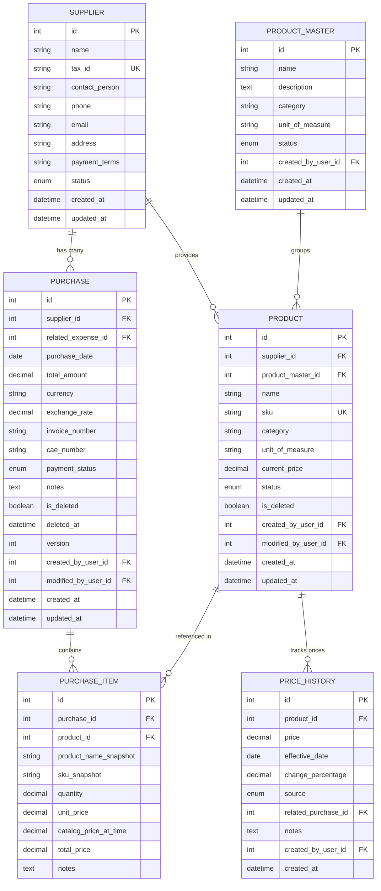
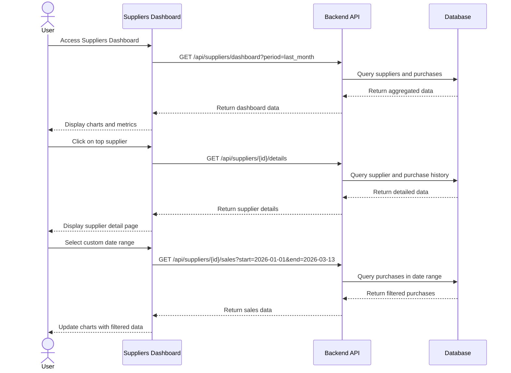
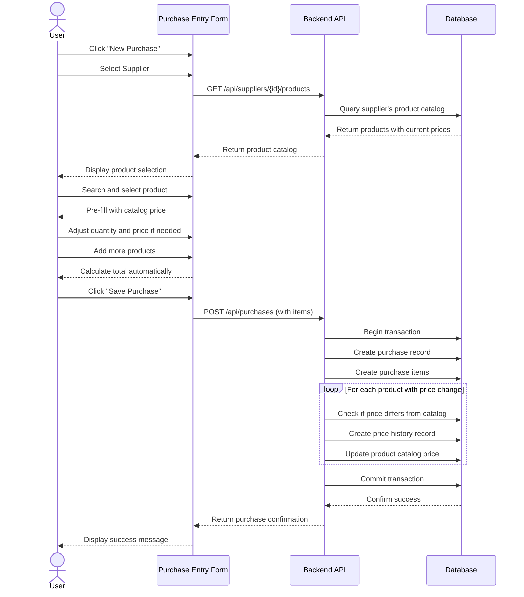

# Feature Specification: Suppliers Management Module

**Created**: March 13, 2026  

## User Scenarios & Testing *(mandatory)*

### User Story 1 - Basic Supplier CRUD Operations (Priority: P1)

As a cafeteria administrator, I need to manage supplier information (create, view, update, delete) so that I can maintain an accurate database of all vendors we work with.

**Why this priority**: This is the foundation of the entire suppliers module. Without the ability to manage supplier data, no other analytics or reporting features can function. This provides immediate value by centralizing supplier information.

**Independent Test**: Can be fully tested by creating a new supplier, viewing their details, updating their information, and deleting them. Delivers a functional supplier database that can be used immediately for manual tracking.

**Acceptance Scenarios**:

1. **Scenario**: Create a new supplier
   - **Given** I am on the suppliers management page
   - **When** I click "Add Supplier" and fill in the form with name, contact info, tax ID, and payment terms
   - **Then** The supplier is created and appears in the suppliers list

2. **Scenario**: View supplier details
   - **Given** I have suppliers in the system
   - **When** I click on a supplier from the list
   - **Then** I see all their information including name, contact details, tax ID, payment terms, and creation date

3. **Scenario**: Update supplier information
   - **Given** I am viewing a supplier's details
   - **When** I click "Edit", modify their contact information, and save
   - **Then** The supplier's information is updated and the changes are reflected immediately

4. **Scenario**: Delete a supplier
   - **Given** I am viewing a supplier's details
   - **When** I click "Delete" and confirm the action
   - **Then** The supplier is removed from the system (with appropriate validation if they have associated purchases)

5. **Scenario**: Search and filter suppliers
   - **Given** I have multiple suppliers in the system
   - **When** I use the search bar to find a supplier by name or filter by status
   - **Then** The list updates to show only matching suppliers

---

### User Story 2 - Supplier Sales History and Details (Priority: P2)

As a cafeteria administrator, I need to view detailed sales history for each supplier over a specific time period so that I can analyze purchasing patterns and supplier performance.

**Why this priority**: This builds on the basic CRUD functionality and provides the first layer of business intelligence. It allows administrators to make data-driven decisions about supplier relationships.

**Independent Test**: Can be tested by selecting a supplier, choosing a date range, and viewing their sales history with totals. Delivers actionable insights about supplier performance.

**Acceptance Scenarios**:

1. **Scenario**: View supplier sales for a specific period
   - **Given** I am viewing a supplier's details page
   - **When** I select a date range (e.g., last month, last quarter, custom range)
   - **Then** I see a list of all purchases from that supplier with dates, amounts, and items

2. **Scenario**: View total sales amount per supplier
   - **Given** I am viewing supplier sales history
   - **When** The data loads for the selected period
   - **Then** I see the total amount spent with that supplier, number of transactions, and average transaction value

3. **Scenario**: Export supplier sales data
   - **Given** I am viewing a supplier's sales history
   - **When** I click "Export"
   - **Then** I receive a CSV/PDF file with the detailed transaction history

4. **Scenario**: Compare periods
   - **Given** I am viewing supplier sales data
   - **When** I select "Compare with previous period"
   - **Then** I see percentage changes and trends compared to the previous equivalent period

---

### User Story 3 - Supplier Purchases Dashboard (Priority: P2)

As a cafeteria administrator, I need a dashboard showing purchase amounts and transaction volumes by supplier so that I can quickly identify top suppliers and spending patterns.

**Why this priority**: Provides visual analytics that complement the detailed sales history. Helps identify which suppliers are most important to the business and where cost optimization opportunities exist.

**Independent Test**: Can be tested by accessing the suppliers dashboard and viewing charts/metrics for all suppliers. Delivers immediate visual insights into supplier relationships.

**Acceptance Scenarios**:

1. **Scenario**: View top suppliers by purchase amount
   - **Given** I am on the suppliers dashboard
   - **When** The page loads
   - **Then** I see a ranked list or chart showing top 10 suppliers by total purchase amount for the selected period

2. **Scenario**: View purchase distribution
   - **Given** I am on the suppliers dashboard
   - **When** I view the purchase distribution chart
   - **Then** I see a pie chart or bar chart showing the percentage of total spending per supplier

3. **Scenario**: Filter dashboard by time period
   - **Given** I am on the suppliers dashboard
   - **When** I select a different time period (this month, last month, this quarter, this year, custom)
   - **Then** All charts and metrics update to reflect the selected period

4. **Scenario**: View key metrics summary
   - **Given** I am on the suppliers dashboard
   - **When** The page loads
   - **Then** I see summary cards showing: total suppliers, total spent, average order value, and most frequent supplier

5. **Scenario**: Drill down from dashboard to supplier details
   - **Given** I am viewing the suppliers dashboard
   - **When** I click on a supplier in any chart
   - **Then** I navigate to that supplier's detailed page with their full sales history

---

### User Story 4 - Purchase Frequency Analysis Dashboard (Priority: P3)

As a cafeteria administrator, I need to see how frequently we purchase from each supplier so that I can optimize ordering schedules and identify opportunities for better terms or consolidation.

**Why this priority**: This is advanced analytics that helps optimize operations. While valuable, it builds on the previous features and is not critical for basic supplier management.

**Independent Test**: Can be tested by viewing the frequency dashboard and analyzing purchase patterns over time. Delivers insights for operational optimization.

**Acceptance Scenarios**:

1. **Scenario**: View purchase frequency by supplier
   - **Given** I am on the purchase frequency dashboard
   - **When** The page loads
   - **Then** I see a chart showing how often (daily, weekly, monthly) we purchase from each supplier

2. **Scenario**: Identify irregular purchasing patterns
   - **Given** I am viewing the frequency dashboard
   - **When** I look at the timeline view
   - **Then** I can see gaps in purchasing or unusual spikes that may indicate supply issues or seasonal patterns

3. **Scenario**: View average days between orders
   - **Given** I am on the frequency dashboard
   - **When** I view supplier metrics
   - **Then** I see the average number of days between orders for each supplier

4. **Scenario**: Compare frequency across suppliers
   - **Given** I am viewing the frequency dashboard
   - **When** I select multiple suppliers
   - **Then** I see a comparative view showing which suppliers we order from most frequently

5. **Scenario**: Set frequency alerts
   - **Given** I am viewing a supplier's frequency data
   - **When** I set a threshold (e.g., "alert if no order in 30 days")
   - **Then** The system will notify me if we haven't ordered from that supplier within the specified timeframe

---

### User Story 5 - Supplier Product Catalog (Priority: P1)

As a cafeteria administrator, I need to view and manage a catalog of products that each supplier provides, including current purchase prices, so that I can quickly reference what each supplier offers and at what cost.

**Why this priority**: This is foundational for purchase management. Without knowing what products each supplier provides and their prices, creating purchases becomes inefficient and error-prone. This enables quick reference and informed purchasing decisions.

**Independent Test**: Can be tested by adding products to a supplier's catalog, viewing the product list with prices, and updating product information. Delivers a searchable catalog of supplier products.

**Acceptance Scenarios**:

1. **Scenario**: Add product to supplier catalog
   - **Given** I am viewing a supplier's details page
   - **When** I click "Add Product" and enter product name, SKU, category, unit of measure, and current purchase price
   - **Then** The product is added to the supplier's catalog and appears in their product list

2. **Scenario**: View all products from a supplier
   - **Given** I am viewing a supplier's details page
   - **When** I navigate to the "Products" tab
   - **Then** I see a list of all products this supplier provides with their current prices, SKU, and last updated date

3. **Scenario**: Update product information
   - **Given** I am viewing a supplier's product catalog
   - **When** I click "Edit" on a product and update its price or details
   - **Then** The product information is updated and the price change is recorded in the price history

4. **Scenario**: Search products within supplier catalog
   - **Given** I am viewing a supplier's product catalog
   - **When** I use the search bar to find a product by name or SKU
   - **Then** The list filters to show only matching products

5. **Scenario**: Compare product prices across suppliers
   - **Given** I am viewing the products section
   - **When** I search for a specific product
   - **Then** I see which suppliers offer that product and their respective prices

---

### User Story 6 - Easy Purchase Entry (Priority: P1)

As a cafeteria administrator, I need a streamlined way to record purchases from suppliers, selecting products from their catalog and defining quantities and prices, so that I can quickly log incoming orders without manual data entry errors.

**Why this priority**: This is critical for day-to-day operations. Without an easy way to record purchases, the system cannot track spending, inventory, or price changes. This directly impacts all analytics and reporting features.

**Independent Test**: Can be tested by creating a new purchase, selecting a supplier, adding products from their catalog, and saving the purchase. Delivers a functional purchase recording system.

**Acceptance Scenarios**:

1. **Scenario**: Create a new purchase from supplier
   - **Given** I am on the purchases page
   - **When** I click "New Purchase", select a supplier, and choose the purchase date
   - **Then** I see a form ready to add products from that supplier's catalog

2. **Scenario**: Add products to purchase from catalog
   - **Given** I am creating a purchase
   - **When** I search and select a product from the supplier's catalog
   - **Then** The product is added with its current catalog price pre-filled, which I can adjust if needed

3. **Scenario**: Add multiple products to single purchase
   - **Given** I am creating a purchase
   - **When** I add multiple products with their quantities and prices
   - **Then** The system calculates the total amount automatically and shows a line-item breakdown

4. **Scenario**: Add new product during purchase entry
   - **Given** I am creating a purchase and the product doesn't exist in the catalog
   - **When** I click "Add New Product" and enter product details
   - **Then** The product is added to the supplier's catalog and included in the current purchase

5. **Scenario**: Save and finalize purchase
   - **Given** I have added all products to a purchase
   - **When** I enter the invoice number and click "Save Purchase"
   - **Then** The purchase is recorded, inventory is updated (if applicable), and price history is updated for all products

6. **Scenario**: Edit existing purchase
   - **Given** I have a recorded purchase
   - **When** I click "Edit" and modify quantities or prices
   - **Then** The purchase is updated and price history reflects the changes with timestamps

---

### User Story 7 - Product Price History Tracking (Priority: P2)

As a cafeteria administrator, I need to view the historical prices of products from each supplier over time so that I can identify price fluctuations, negotiate better terms, and forecast costs accurately.

**Why this priority**: This provides valuable business intelligence for cost management and supplier negotiations. While important, it builds on the purchase entry system and is not critical for basic operations.

**Independent Test**: Can be tested by viewing a product's price history chart showing all price changes over time. Delivers insights into price trends and volatility.

**Acceptance Scenarios**:

1. **Scenario**: View price history for a product
   - **Given** I am viewing a product in a supplier's catalog
   - **When** I click "View Price History"
   - **Then** I see a timeline or chart showing all historical prices with dates of change

2. **Scenario**: Identify price fluctuations
   - **Given** I am viewing a product's price history
   - **When** The chart loads
   - **Then** I can see percentage changes between price points and identify trends (increasing, decreasing, stable)

3. **Scenario**: Compare current vs historical prices
   - **Given** I am viewing a product's price history
   - **When** I look at the summary metrics
   - **Then** I see current price, average price, highest price, lowest price, and percentage change over selected period

4. **Scenario**: Filter price history by date range
   - **Given** I am viewing a product's price history
   - **When** I select a custom date range (e.g., last 6 months, last year)
   - **Then** The chart updates to show only price changes within that period

5. **Scenario**: Export price history report
   - **Given** I am viewing price history for one or multiple products
   - **When** I click "Export"
   - **Then** I receive a CSV/PDF with detailed price history including dates, prices, and percentage changes

6. **Scenario**: Set price change alerts
   - **Given** I am viewing a product
   - **When** I set a threshold (e.g., "alert if price increases by more than 10%")
   - **Then** The system notifies me when the product's price changes beyond the threshold

7. **Scenario**: View products with highest price volatility
   - **Given** I am on the price analytics dashboard
   - **When** I view the volatility report
   - **Then** I see a ranked list of products with the most price fluctuations over the selected period

---

### Edge Cases

- What happens when attempting to delete a supplier that has associated purchase records?
  - System should prevent deletion and suggest archiving instead, or require confirmation with warning about data integrity
  
- How does the system handle suppliers with no purchase history?
  - Display appropriate "No data available" messages in analytics views
  - Allow creation and management but show zero values in dashboards
  
- What happens when date ranges have no transactions?
  - Display "No transactions in this period" message
  - Suggest expanding the date range or checking filters
  
- How does the system handle duplicate supplier names?
  - Warn user if a similar name exists
  - Require unique tax ID or business identifier
  
- What happens with suppliers in different currencies?
  - Convert all amounts to a base currency for comparison
  - Display original currency with converted amount
  
- How are partial periods handled in frequency analysis?
  - Clearly indicate when viewing incomplete periods (e.g., "current month to date")
  - Adjust frequency calculations to account for partial periods

- What happens when attempting to delete a product that has purchase history?
  - System should prevent deletion and suggest archiving or marking as discontinued
  - Show warning with count of historical purchases

- How does the system handle duplicate product names from the same supplier?
  - Warn user if similar product name exists for that supplier
  - Require unique SKU per supplier to differentiate

- What happens when a product price changes during purchase entry?
  - Allow override of catalog price during purchase entry
  - Record both catalog price and actual purchase price
  - Automatically update catalog price if actual price differs significantly

- How does the system handle products supplied by multiple suppliers?
  - Allow same product to exist in multiple supplier catalogs
  - Enable price comparison across suppliers for the same product
  - Use product name/SKU matching to identify duplicates

- What happens when editing a historical purchase?
  - Maintain audit trail of all changes with timestamps and user
  - Update price history to reflect the correction
  - Show warning if editing old purchases (e.g., >30 days old)

- How are price fluctuations calculated when there's insufficient data?
  - Require minimum 2 price points to show trends
  - Display "Insufficient data" message for new products
  - Show data collection period (e.g., "Based on 3 months of data")

## Clarifications & Business Rules *(mandatory)*

### Product Catalog Management

**Q: ¿Cómo se determina si un producto es "el mismo" entre diferentes proveedores?**
- **A**: **DECISIÓN**: Implementar sistema de vinculación de productos entre proveedores
- Los productos siguen siendo independientes por proveedor (cada uno con su SKU y precio)
- Se agrega entidad **ProductMaster** para vincular productos equivalentes:
  - Un ProductMaster puede tener múltiples Products de diferentes proveedores
  - Permite comparar precios del "mismo" producto entre proveedores
  - Facilita análisis de costos y decisiones de compra
  - El usuario puede vincular/desvincular productos manualmente
- **Ejemplo**: "Aceite de Oliva 1L" de Proveedor A y Proveedor B se vinculan al mismo ProductMaster "Aceite de Oliva 1L"

**Q: ¿Qué pasa si cambio el precio de un producto en el catálogo manualmente?**
- **A**: Se crea automáticamente un registro en PriceHistory con:
  - Source: "catalog_update"
  - Effective date: fecha actual
  - Change percentage: calculado vs precio anterior
  - Created by: usuario que hizo el cambio

**Q: ¿Cuándo se actualiza automáticamente el precio del catálogo desde una compra?**
- **A**: **DECISIÓN**: Siempre confirmar con el usuario antes de actualizar
- Cuando el precio de compra difiere del precio del catálogo:
  - Se muestra modal: "El precio de compra ($Y) difiere del catálogo ($X). ¿Actualizar precio del catálogo?"
  - Opciones: "Actualizar catálogo", "Mantener precio actual", "No preguntar para este producto"
- Si el usuario elige actualizar, se crea registro en PriceHistory automáticamente

**Q: ¿Se puede tener un producto sin precio en el catálogo?**
- **A**: No. El precio es obligatorio al crear un producto.
- Si el precio es variable o desconocido, el usuario debe ingresar un precio estimado o el último precio conocido.
- El precio se puede actualizar en cualquier momento.

### Purchase Entry & Price History

**Q: ¿Qué sucede si edito el precio de un producto en una compra ya guardada?**
- **A**: 
  1. Se actualiza el PurchaseItem con el nuevo precio
  2. Se recalcula el total de la compra
  3. Se crea un nuevo registro en PriceHistory con source: "purchase_correction"
  4. Se mantiene el registro original de PriceHistory (no se elimina)
  5. Se registra en audit trail: usuario, fecha, campo modificado, valor anterior, valor nuevo

**Q: ¿Cómo se calcula el "change_percentage" en PriceHistory?**
- **A**: `((new_price - previous_price) / previous_price) * 100`
- Si es el primer precio del producto, change_percentage = NULL o 0
- Valores positivos = aumento, valores negativos = disminución

**Q: ¿Qué fecha se usa como "effective_date" en PriceHistory?**
- **A**: 
  - Para catalog_update: fecha actual del cambio
  - Para purchase_entry: fecha de la compra (purchase_date), no la fecha de creación del registro
  - Para purchase_correction: fecha de la modificación (no la fecha original de compra)

**Q: ¿Se puede eliminar una compra?**
- **A**: Sí, pero con restricciones:
  - Solo si la compra tiene menos de 7 días de antigüedad (configurable)
  - Requiere confirmación del usuario
  - Al eliminar: se marca como "deleted" (soft delete) en lugar de eliminarse físicamente
  - Los registros de PriceHistory asociados se mantienen pero se marcan con una nota
  - **Alternativa**: No permitir eliminación, solo anulación con una compra de ajuste negativo

**Q: ¿Cómo se manejan las compras con múltiples monedas?**
- **A**: 
  - Cada compra tiene un campo "currency" (USD, ARS, EUR, etc.)
  - Se define una moneda base del sistema (ej: ARS)
  - Para dashboards y reportes, se convierten todas las monedas a la moneda base
  - **DECISIÓN**: Tabla manual de tipos de cambio
  - **DECISIÓN**: El tipo de cambio es histórico - se guarda en el momento de la compra para mantener consistencia histórica
  - Los reportes usan el tipo de cambio guardado en cada compra, no el actual

### Inventory Integration

**Q: ¿Cómo se relaciona esto con el inventario?**
- **A**: **DECISIÓN**: La integración con inventario es posterior, no se implementa en las primeras fases.
- En Fase 1: Solo se registran compras sin afectar inventario
- En fases futuras: Se agregará integración opcional con módulo de inventario
- Los campos y estructura de datos se diseñan pensando en futura integración

### Alerts & Notifications

**Q: ¿Cómo funcionan las alertas de precio y frecuencia?**
- **A**: 
  - Las alertas se configuran por producto o por proveedor
  - Se evalúan en tiempo real cuando se guarda una compra o se actualiza un precio
  - **DECISIÓN**: Notificaciones in-app solamente (badge, popup, centro de notificaciones)
  - Las alertas las reciben los usuarios con rol Administrador
  - Se muestra un badge con contador de alertas no leídas
  - Centro de notificaciones accesible desde el header

**Q: ¿Las alertas de frecuencia se evalúan automáticamente?**
- **A**: 
  - Se debe ejecutar un job diario que verifique las alertas de frecuencia
  - Compara la fecha de la última compra vs el umbral configurado
  - Si se supera el umbral, genera una notificación

### Data Validation & Business Rules

**Q: ¿Qué validaciones se aplican al crear/editar productos?**
- **A**: 
  - **Nombre**: Requerido, 3-200 caracteres, no puede ser solo espacios
  - **SKU**: Requerido, único por proveedor, 2-50 caracteres, alfanumérico + guiones
  - **Precio**: Requerido, > 0, máximo 2 decimales
  - **Categoría**: **DECISIÓN**: Lista predefinida configurable por administrador
  - **Unidad de medida**: **DECISIÓN**: Lista predefinida configurable (kg, L, unidad, caja, etc.)

**Q: ¿Qué validaciones se aplican a las compras?**
- **A**: 
  - **Fecha de compra**: Requerida, no puede ser futura, no puede ser más de 1 año en el pasado (configurable)
  - **Proveedor**: Requerido, debe existir y estar activo
  - **Productos**: Mínimo 1 producto requerido
  - **Cantidad**: > 0, máximo 4 decimales
  - **Precio unitario**: > 0, máximo 2 decimales
  - **Número de factura**: Opcional pero recomendado, único por proveedor (warning si duplicado)

**Q: ¿Qué validaciones se aplican a los proveedores?**
- **A**: 
  - **Nombre**: Requerido, 3-200 caracteres
  - **Tax ID**: Requerido, único en el sistema, **DECISIÓN**: No validar formato específico CUIT/CUIL
  - **Email**: Opcional, formato válido si se proporciona
  - **Teléfono**: Opcional, formato libre
  - **Payment terms**: **DECISIÓN**: Lista predefinida configurable por administrador

### Permissions & Access Control

**Q: ¿Qué roles y permisos se necesitan?**
- **A**: **DECISIÓN**: Solo rol Administrador en Fase 1
  - **Administrador**: Acceso completo a todas las funcionalidades
    - CRUD proveedores, productos, compras
    - Configurar alertas y categorías
    - Ver todos los dashboards y reportes
    - Exportar datos
    - Configurar listas predefinidas (categorías, unidades, payment terms)
  - Roles adicionales (Manager, Viewer, Purchaser) se implementarán en fases posteriores si es necesario

**Q: ¿Se pueden editar compras de otros usuarios?**
- **A**: **DECISIÓN**: Como solo hay rol Administrador en Fase 1, cualquier administrador puede editar cualquier compra
  - Se mantiene audit trail completo de quién creó y quién modificó
  - Se muestra warning si se edita una compra de otro usuario
  - En fases futuras con más roles, se implementará control más granular

### Reporting & Analytics

**Q: ¿Cómo se calculan los "top suppliers" cuando hay múltiples monedas?**
- **A**: Se convierten todos los montos a la moneda base usando los tipos de cambio guardados en cada compra.

**Q: ¿Qué período se usa por defecto en los dashboards?**
- **A**: **DECISIÓN**: Mes actual (del 1 al día actual) por defecto
  - El usuario puede cambiar a otros períodos: último mes, últimos 30 días, trimestre, año, custom
  - La selección se guarda en preferencias del usuario

**Q: ¿Cómo se maneja el "average order value" cuando hay diferentes monedas?**
- **A**: Se calcula sobre los montos convertidos a moneda base.

**Q: ¿Los reportes exportados incluyen datos sensibles?**
- **A**: **DECISIÓN**: No hay restricciones de privacidad o compliance
  - Los precios se incluyen en las exportaciones
  - Se mantiene log de quién exportó qué datos (audit trail)
  - No hay restricciones especiales de acceso a datos

### Archive vs Delete

**Q: ¿Cuál es la diferencia entre "archived" e "inactive"?**
- **A**: 
  - **Inactive**: Proveedor/producto temporalmente no disponible, puede reactivarse fácilmente
  - **Archived**: Proveedor/producto que ya no se usa pero se mantiene por historial, no aparece en búsquedas normales
  - **Deleted**: Eliminación lógica (soft delete), solo visible para admins en vistas especiales

**Q: ¿Los productos/proveedores archivados aparecen en reportes históricos?**
- **A**: Sí, los datos históricos siempre incluyen productos/proveedores archivados para mantener precisión de reportes.

### Technical & Implementation Details

**Q: ¿Cómo se maneja la concurrencia cuando dos usuarios editan la misma compra simultáneamente?**
- **A**: **NEEDS CLARIFICATION** - Opciones:
  - Opción 1: Optimistic locking con timestamp de última modificación
  - Opción 2: Pessimistic locking (bloquear registro durante edición)
  - Opción 3: Last write wins (el último cambio sobrescribe)
  - **Recomendación**: Opción 1 con mensaje de error si hay conflicto

**Q: ¿Qué pasa si se actualiza el precio del catálogo mientras alguien está creando una compra?**
- **A**: 
  - El precio se carga cuando se selecciona el producto
  - Si el catálogo cambia durante la edición, el usuario mantiene el precio cargado
  - Al guardar, se compara con el precio actual del catálogo
  - Si difiere, se muestra confirmación al usuario

**Q: ¿Cómo se manejan los tipos de cambio de moneda?**
- **A**: **NEEDS CLARIFICATION**:
  - ¿Se integra con API externa (ej: exchangerate-api.com)?
  - ¿Se mantiene tabla manual de tipos de cambio?
  - ¿Con qué frecuencia se actualizan?
  - **Recomendación**: 
    - Tabla `exchange_rates` con: from_currency, to_currency, rate, effective_date
    - Al crear compra en moneda extranjera, se guarda el tipo de cambio del día
    - Admin puede actualizar tipos de cambio manualmente
    - Opcionalmente: job diario que consulta API y actualiza tasas

**Q: ¿Qué nivel de precisión se usa para cálculos monetarios?**
- **A**: 
  - Todos los cálculos internos usan precisión decimal (no float)
  - Precios: 2 decimales
  - Cantidades: hasta 4 decimales (para productos que se venden por peso/volumen)
  - Totales: 2 decimales con redondeo estándar (0.5 hacia arriba)

**Q: ¿Cómo se manejan los productos que cambian de unidad de medida?**
- **A**: **NEEDS CLARIFICATION**:
  - ¿Se permite cambiar la unidad de medida de un producto existente?
  - Si se cambia, ¿cómo afecta al historial de precios?
  - **Recomendación**: No permitir cambio de unidad de medida. Si cambia, crear nuevo producto.

### UI/UX Clarifications

**Q: ¿Cómo se visualiza la comparación de precios entre proveedores?**
- **A**: **NEEDS CLARIFICATION** - Propuesta:
  - Vista de tabla con columnas: Producto, Proveedor 1, Proveedor 2, ..., Mejor Precio
  - Resaltar en verde el precio más bajo
  - Mostrar diferencia porcentual vs precio más bajo
  - Filtrar por categoría de producto

**Q: ¿Qué información se muestra en la lista de proveedores?**
- **A**: Vista de tabla/cards con:
  - Nombre del proveedor
  - Tax ID (parcialmente oculto por seguridad: XXX-XX-1234)
  - Estado (badge: activo/inactivo/archivado)
  - Última compra (fecha)
  - Total gastado (período actual)
  - Número de productos en catálogo
  - Acciones rápidas (ver, editar, productos, nueva compra)

**Q: ¿Cómo se presenta el historial de precios visualmente?**
- **A**: 
  - Gráfico de línea temporal con puntos en cada cambio de precio
  - Eje X: fechas, Eje Y: precio
  - Tooltip al pasar mouse: fecha, precio, % cambio, fuente del cambio
  - Línea horizontal punteada mostrando precio promedio
  - Opción de zoom para períodos específicos

**Q: ¿Qué pasa cuando un usuario intenta agregar un producto que ya existe en el catálogo del proveedor?**
- **A**: 
  - Búsqueda en tiempo real mientras escribe el nombre/SKU
  - Si encuentra coincidencia: "Este producto ya existe. ¿Deseas editarlo?"
  - Mostrar el producto existente con opción de editar o cancelar
  - Prevenir duplicados por SKU (validación estricta)

### Performance & Scalability

**Q: ¿Cuántos registros se espera manejar?**
- **A**: **NEEDS CLARIFICATION** - Estimaciones para diseño:
  - Proveedores: 50-200 activos
  - Productos: 500-5000 total
  - Compras: 100-500 por mes
  - Historial de precios: crecimiento continuo, 1000-10000 registros/año

**Q: ¿Cómo se optimizan las consultas de dashboards?**
- **A**: **DECISIÓN**: Empezar con consultas en tiempo real (Opción 1)
  - Implementación simple y directa para MVP
  - Si hay problemas de performance, migrar a cache con TTL
  - Monitorear tiempos de respuesta y optimizar según necesidad real

**Q: ¿Se implementa paginación en todas las listas?**
- **A**: **DECISIÓN**: Seguir el diseño actual de la aplicación
- Tamaño de página configurable (default: 25, 50, 100)
- Total de registros visible
- Mantener consistencia con el resto de la aplicación Galia

### Data Migration & Import

**Q: ¿Se necesita importar datos existentes de proveedores/productos?**
- **A**: **DECISIÓN**: Sí, actualmente hay gastos registrados
  - **Importante**: No todos los gastos son compras, pero todas las compras son gastos
  - Se necesita funcionalidad para:
    1. Migrar gastos existentes que correspondan a compras a proveedores
    2. Vincular gastos futuros con compras cuando corresponda
    3. Mantener separación clara: algunos gastos no tienen proveedor asociado
  - **Implementación sugerida**:
    - Campo opcional en Purchase: `related_expense_id` para vincular con sistema de gastos
    - Al crear compra, opción de "Crear desde gasto existente"
    - Los gastos mantienen su propia entidad, las compras son un subset con más detalle

**Q: ¿Se permite exportación masiva de datos?**
- **A**: Sí, con restricciones:
  - Solo usuarios con permisos específicos
  - Log de todas las exportaciones (quién, qué, cuándo)
  - Formatos: CSV, Excel, PDF
  - Límite de registros por exportación (ej: 10,000)

### Integration Points

**Q: ¿Se integra con sistema contable existente?**
- **A**: **DECISIÓN**: No hay integración contable por el momento
  - No se implementa en Fase 1 ni fases cercanas
  - Diseñar estructura de datos pensando en posible integración futura
  - Los datos de compras pueden exportarse para uso manual en contabilidad si es necesario

**Q: ¿Se necesita integración con sistema de facturación electrónica?**
- **A**: **DECISIÓN**: No es necesaria validación AFIP
  - No se requiere integración con AFIP
  - Campo opcional `cae_number` en compras para referencia manual si el usuario lo desea
  - Sin validación automática de CAE

### Summary of Decisions - ALL RESOLVED ✅

Todas las decisiones han sido resueltas. A continuación el resumen:

#### Decisiones de Arquitectura y Datos
1. **Roles y Permisos**: ✅ Solo rol Administrador en Fase 1
2. **Moneda y Tipos de Cambio**: ✅ Tabla manual, tipo de cambio histórico guardado en cada compra
3. **Integración con Inventario**: ✅ Posterior, no en Fase 1
4. **Validación Tax ID**: ✅ No validar formato CUIT/CUIL
5. **Categorías de Productos**: ✅ Lista predefinida configurable
6. **Payment Terms**: ✅ Lista predefinida configurable
7. **Product Linking**: ✅ Implementar sistema ProductMaster para vincular productos entre proveedores

#### Decisiones de UX y Comportamiento
8. **Notificaciones**: ✅ In-app solamente, para Administradores
9. **Período Default Dashboard**: ✅ Mes actual (del 1 al día actual)
10. **Paginación**: ✅ Seguir diseño actual de la aplicación Galia
11. **Actualización Automática de Precios**: ✅ Siempre confirmar con el usuario

#### Decisiones de Integración y Datos
12. **Integración con Gastos**: ✅ Sí - vincular compras con sistema de gastos existente (campo `related_expense_id`)
13. **Integración Contable**: ✅ No hay integración por el momento
14. **Facturación Electrónica**: ✅ No validar AFIP, campo opcional CAE
15. **Exportación de Datos**: ✅ Sin restricciones de compliance, incluir precios, mantener audit log

### Recommended Implementation Phases

**Fase 1 - MVP (4-6 semanas)**
- User Stories P1: CRUD Suppliers, Product Catalog, Purchase Entry
- ProductMaster entity y vinculación de productos
- ConfigurableList para categorías, unidades, payment terms
- Tabla manual de tipos de cambio (ExchangeRate)
- Integración con sistema de gastos (campo related_expense_id)
- Validaciones básicas
- Sin integración con inventario
- Solo rol Administrador
- Notificaciones in-app simples
- Confirmación de actualización de precios

**Fase 2 - Analytics (2-3 semanas)**
- User Stories P2: Sales History, Purchase Dashboard, Price History
- Dashboards y reportes
- Exportación CSV/PDF
- Alertas de precio

**Fase 3 - Advanced Features (2-3 semanas)**
- User Story P3: Frequency Analysis
- Alertas de frecuencia
- Comparación multi-proveedor avanzada
- Importación CSV
- Integración con inventario (si aplica)

**Fase 4 - Optimización y Futuras Mejoras (1-2 semanas)**
- Performance optimization
- Cache de dashboards si es necesario
- Roles y permisos granulares (Manager, Viewer, Purchaser)
- Integración con inventario
- Importación masiva de datos CSV
- API de tipos de cambio automática (opcional)
- Integraciones externas (contabilidad, etc.) si aplica

## Requirements *(mandatory)*

### Functional Requirements

- **FR-001**: System MUST allow users to create suppliers with required fields: name, tax ID/business ID, contact information (phone, email, address), and payment terms
- **FR-002**: System MUST allow users to update all supplier information except system-generated IDs and creation timestamps
- **FR-003**: System MUST allow users to delete or archive suppliers with appropriate validation for suppliers with purchase history
- **FR-004**: System MUST provide search functionality to find suppliers by name, tax ID, or contact information
- **FR-005**: System MUST allow filtering suppliers by status (active, inactive, archived)
- **FR-006**: System MUST display a detailed view of each supplier including all their information and associated purchase history
- **FR-007**: System MUST allow users to select custom date ranges for viewing supplier sales data
- **FR-008**: System MUST calculate and display total purchase amounts per supplier for selected periods
- **FR-009**: System MUST show the number of transactions and average transaction value per supplier
- **FR-010**: System MUST provide a dashboard with visual charts showing purchase amounts by supplier
- **FR-011**: System MUST display top suppliers ranked by total purchase amount
- **FR-012**: System MUST show purchase distribution across suppliers (percentage of total spending)
- **FR-013**: System MUST calculate and display purchase frequency metrics (orders per week/month, average days between orders)
- **FR-014**: System MUST provide a timeline or calendar view showing purchase frequency patterns
- **FR-015**: System MUST allow comparison of metrics across different time periods
- **FR-016**: System MUST support exporting supplier data and reports to CSV/PDF formats
- **FR-017**: System MUST validate unique tax ID/business ID to prevent duplicate suppliers
- **FR-018**: System MUST track creation and modification timestamps for all supplier records
- **FR-019**: System MUST support pagination for supplier lists when there are many records
- **FR-020**: System MUST provide role-based access control for supplier management operations [NEEDS CLARIFICATION: specific roles and permissions not yet defined]
- **FR-021**: System MUST allow users to add products to a supplier's catalog with required fields: name, SKU, category, unit of measure, and current purchase price
- **FR-022**: System MUST allow users to view all products associated with a supplier in a searchable and filterable list
- **FR-023**: System MUST allow users to update product information including price, with automatic recording of price changes in history
- **FR-024**: System MUST prevent deletion of products that have associated purchase history, requiring archival instead
- **FR-025**: System MUST validate unique SKU per supplier to prevent duplicate products
- **FR-026**: System MUST enable cross-supplier product search to compare prices for the same product across multiple suppliers
- **FR-027**: System MUST provide a streamlined purchase entry interface that allows selecting a supplier and adding products from their catalog
- **FR-028**: System MUST pre-fill product prices from the catalog during purchase entry, with ability to override if actual price differs
- **FR-029**: System MUST allow adding new products to a supplier's catalog during purchase entry without leaving the purchase form
- **FR-030**: System MUST calculate total purchase amount automatically based on line items (quantity × price)
- **FR-031**: System MUST allow editing existing purchases with full audit trail of changes
- **FR-032**: System MUST record price history automatically whenever a product's price changes through catalog update or purchase entry
- **FR-033**: System MUST display price history for each product showing all historical prices with dates and percentage changes
- **FR-034**: System MUST calculate price trend metrics including average price, highest price, lowest price, and volatility
- **FR-035**: System MUST allow filtering price history by custom date ranges
- **FR-036**: System MUST support price change alerts when a product's price fluctuates beyond a defined threshold
- **FR-037**: System MUST identify and display products with highest price volatility for cost management analysis
- **FR-038**: System MUST maintain audit trail for all purchase edits including timestamp, user, and changed fields
- **FR-039**: System MUST support multiple suppliers providing the same product with independent pricing
- **FR-040**: System MUST export product catalogs and price history reports to CSV/PDF formats
- **FR-041**: System MUST provide ProductMaster entity to link equivalent products across different suppliers
- **FR-042**: System MUST allow administrators to manually link/unlink products to ProductMaster records
- **FR-043**: System MUST display cross-supplier price comparison for products linked to the same ProductMaster
- **FR-044**: System MUST validate that products linked to same ProductMaster have matching unit of measure
- **FR-045**: System MUST provide configurable lists for product categories, units of measure, and payment terms
- **FR-046**: System MUST allow only administrators to add/edit/deactivate values in configurable lists
- **FR-047**: System MUST prevent deletion of configurable list values that are in use
- **FR-048**: System MUST provide field to link purchases with existing expenses (related_expense_id)
- **FR-049**: System MUST allow creating purchases from existing expense records
- **FR-050**: System MUST maintain that all purchases are expenses, but not all expenses are purchases
- **FR-051**: System MUST store exchange rates manually entered by administrators in ExchangeRate table
- **FR-052**: System MUST use historical exchange rate from purchase date for all reporting and conversions
- **FR-053**: System MUST display in-app notifications for price and frequency alerts to administrators only
- **FR-054**: System MUST provide notification center accessible from header with unread badge counter
- **FR-055**: System MUST default dashboard period to current month (from day 1 to current day)
- **FR-056**: System MUST save user's selected dashboard period preference
- **FR-057**: System MUST always prompt user for confirmation before updating catalog price from purchase price
- **FR-058**: System MUST provide option "Don't ask again for this product" in price update confirmation
- **FR-059**: System MUST follow existing Galia application design patterns for pagination and UI consistency
- **FR-060**: System MUST log all data exports in audit trail including user, timestamp, and exported data type

### Key Entities

- **Supplier**: Represents a vendor or provider that supplies goods to the cafeteria
  - Key attributes: 
    - unique ID (PK)
    - name (required, 3-200 chars)
    - tax ID/business ID (required, unique, format validation pending)
    - contact person (optional)
    - phone (optional)
    - email (optional, validated format)
    - address (optional)
    - payment terms (optional, text or predefined list - pending decision)
    - status (enum: active/inactive/archived)
    - is_deleted (boolean, for soft delete)
    - creation date
    - last modified date
    - created by user ID
    - last modified by user ID
  - Relationships: Has many Purchases, Has many Products
  - Business Rules:
    - Cannot be deleted if has purchase history (must archive)
    - Tax ID must be unique across system
    - Name required and cannot be only whitespace
  
- **ProductMaster**: Represents a generic product that can be sourced from multiple suppliers
  - Key attributes:
    - unique ID (PK)
    - name (required, 3-200 chars, e.g., "Aceite de Oliva 1L")
    - description (optional, text)
    - category (optional, from predefined configurable list)
    - unit of measure (required, from predefined configurable list: kg, L, unidad, caja, etc.)
    - status (enum: active/archived)
    - creation date
    - last modified date
    - created by user ID
  - Relationships: Has many Products (from different suppliers)
  - Business Rules:
    - Used for cross-supplier price comparison
    - Products can be linked/unlinked manually by user
    - A Product can belong to only one ProductMaster (or none)
    - Archiving ProductMaster doesn't affect linked Products
  
- **Product**: Represents an item that can be purchased from a specific supplier
  - Key attributes: 
    - unique ID (PK)
    - supplier ID (FK, required)
    - product_master_id (FK, optional, links to ProductMaster)
    - name (required, 3-200 chars)
    - SKU (required, unique per supplier, 2-50 chars, alpanumeric + hyphens)
    - category (optional, from predefined configurable list)
    - unit of measure (required, from predefined configurable list: kg, L, unidad, caja, etc.)
    - current purchase price (required, decimal, >0, 2 decimals)
    - status (enum: active/discontinued/archived)
    - is_deleted (boolean, for soft delete)
    - creation date
    - last modified date
    - created by user ID
    - last modified by user ID
  - Relationships: Belongs to one Supplier, Optionally belongs to one ProductMaster, Has many PurchaseItems, Has many PriceHistory records
  - Business Rules:
    - Cannot be deleted if has purchase history (must archive)
    - SKU must be unique per supplier
    - Price must be >0
    - Unit of measure cannot be changed (create new product if needed)
    - If linked to ProductMaster, unit of measure should match
  
- **Purchase/Order**: Represents a transaction with a supplier
  - Key attributes: 
    - unique ID (PK)
    - supplier ID (FK, required)
    - related_expense_id (FK, optional, links to existing expense in expense system)
    - purchase date (required, cannot be future, max 1 year in past)
    - total amount (calculated, decimal, 2 decimals)
    - currency (required, enum: ARS, USD, EUR, etc.)
    - exchange_rate (decimal, stored at time of purchase for historical accuracy)
    - invoice number (optional but recommended, unique per supplier with warning)
    - cae_number (optional, for Argentina electronic invoicing - no validation)
    - payment status (enum: pending/paid/partial/cancelled)
    - notes (text, optional)
    - is_deleted (boolean, for soft delete)
    - deleted_at (timestamp, if soft deleted)
    - created by user ID
    - creation timestamp
    - last modified by user ID
    - last modified timestamp
    - version (integer, for optimistic locking)
  - Relationships: Belongs to one Supplier, Has many PurchaseItems, Optionally references one Expense
  - Business Rules:
    - Can only be deleted within 7 days (configurable)
    - Requires at least 1 PurchaseItem
    - Total amount auto-calculated from items
    - Soft delete only (maintains data integrity)
    - All purchases are expenses, but not all expenses are purchases
    - Can be created from existing expense or standalone
  
- **PurchaseItem**: Represents individual line items within a purchase
  - Key attributes: 
    - unique ID (PK)
    - purchase ID (FK, required)
    - product ID (FK, required)
    - product_name_snapshot (text, product name at time of purchase)
    - sku_snapshot (text, SKU at time of purchase)
    - quantity (decimal, >0, max 4 decimals)
    - unit_price (decimal, actual price paid, >0, 2 decimals)
    - catalog_price_at_time (decimal, catalog price when purchase was created)
    - total_price (calculated: quantity × unit_price, 2 decimals)
    - notes (text, optional)
  - Relationships: Belongs to one Purchase, References one Product
  - Business Rules:
    - Quantity must be >0
    - Unit price must be >0
    - Snapshots preserve historical data even if product is modified/deleted
  
- **PriceHistory**: Tracks historical price changes for products
  - Key attributes: 
    - unique ID (PK)
    - product ID (FK, required)
    - price (decimal, >0, 2 decimals)
    - effective date (date, when price became effective)
    - change_percentage (decimal, calculated vs previous price, can be NULL for first entry)
    - source (enum: catalog_update, purchase_entry, purchase_correction, manual_adjustment)
    - related_purchase_id (FK, optional, if source is purchase_entry or purchase_correction)
    - notes (text, optional, e.g., "Price corrected due to invoice error")
    - created by user ID
    - creation timestamp
  - Relationships: Belongs to one Product, Optionally references one Purchase
  - Business Rules:
    - Automatically created on catalog price update
    - Automatically created when purchase price differs from catalog
    - Never deleted (maintains complete price history)
    - Change percentage = ((new_price - previous_price) / previous_price) × 100

- **ExchangeRate**: Stores currency conversion rates (optional, pending decision on implementation)
  - Key attributes:
    - unique ID (PK)
    - from_currency (enum: ARS, USD, EUR, etc.)
    - to_currency (enum: ARS, USD, EUR, etc.)
    - rate (decimal, high precision)
    - effective_date (date)
    - source (enum: manual, api, system)
    - created by user ID
    - creation timestamp
  - Relationships: Referenced by Purchases for historical conversion
  - Business Rules:
    - Combination of from_currency, to_currency, effective_date should be unique
    - Rate must be >0

- **AuditLog**: Tracks all changes to critical entities (optional but recommended)
  - Key attributes:
    - unique ID (PK)
    - entity_type (enum: supplier, product, product_master, purchase, purchase_item)
    - entity_id (integer, ID of the modified record)
    - action (enum: create, update, delete, archive, link, unlink, export)
    - field_name (text, which field was changed)
    - old_value (text/json)
    - new_value (text/json)
    - user_id (FK, who made the change)
    - timestamp
    - ip_address (optional)
  - Business Rules:
    - Never deleted
    - Automatically created on all CUD operations
    - Used for compliance and debugging
    - Includes export actions for data security

- **ConfigurableList**: Stores predefined configurable lists (categories, units, payment terms)
  - Key attributes:
    - unique ID (PK)
    - list_type (enum: product_category, unit_of_measure, payment_terms)
    - value (text, the actual value)
    - display_order (integer, for sorting)
    - is_active (boolean)
    - created by user ID
    - creation timestamp
  - Business Rules:
    - Only Administrators can modify
    - Cannot delete values in use (must deactivate)
    - Default values provided on system initialization

## Success Criteria *(mandatory)*

### Measurable Outcomes

- **SC-001**: Users can create a new supplier with all required information in under 2 minutes
- **SC-002**: Users can find a specific supplier using search in under 10 seconds
- **SC-003**: Dashboard loads and displays supplier analytics for up to 100 suppliers in under 3 seconds
- **SC-004**: 90% of users successfully complete basic supplier CRUD operations on first attempt without assistance
- **SC-005**: Supplier sales reports can be generated and exported for any date range in under 5 seconds
- **SC-006**: Purchase frequency analysis accurately reflects ordering patterns with 100% data accuracy
- **SC-007**: System prevents creation of duplicate suppliers (same tax ID) 100% of the time
- **SC-008**: All supplier dashboards are responsive and functional on mobile devices (tablets and phones)
- **SC-009**: Users can identify their top 5 suppliers by spending within 30 seconds of opening the dashboard
- **SC-010**: Reduce time spent on manual supplier tracking and reporting by 60% compared to spreadsheet-based methods
- **SC-011**: Users can add a new product to a supplier's catalog in under 1 minute
- **SC-012**: Users can create a complete purchase with multiple products in under 3 minutes
- **SC-013**: Product catalog search returns results in under 1 second for catalogs with up to 1000 products
- **SC-014**: 95% of purchase entries use catalog products (vs. manual entry), indicating catalog adoption
- **SC-015**: Price history is automatically recorded with 100% accuracy for all price changes
- **SC-016**: Users can identify price trends for a product within 15 seconds of viewing its details
- **SC-017**: System detects and alerts on price increases >10% within 24 hours of the change
- **SC-018**: Cross-supplier price comparison shows results for matching products in under 2 seconds
- **SC-019**: Purchase entry errors (wrong prices, missing products) reduced by 80% compared to manual entry
- **SC-020**: Users can export complete product catalog with price history in under 10 seconds

### Mermaid Diagrams

```mermaid
flowchart TD
    A[Suppliers Module] --> B[Supplier Management]
    A --> C[Product Catalog]
    A --> D[Purchase Management]
    A --> E[Analytics & Dashboards]
    
    B --> B1[Create Supplier]
    B --> B2[View Suppliers List]
    B --> B3[Edit Supplier]
    B --> B4[Delete/Archive Supplier]
    B --> B5[Search & Filter]
    
    C --> C1[View Supplier Products]
    C --> C2[Add Product to Catalog]
    C --> C3[Edit Product]
    C --> C4[Search Products]
    C --> C5[Compare Prices Across Suppliers]
    
    D --> D1[Create Purchase]
    D --> D2[Add Products from Catalog]
    D --> D3[Add New Product During Entry]
    D --> D4[Edit Purchase]
    D --> D5[View Purchase History]
    
    E --> E1[Supplier Details Page]
    E --> E2[Purchase Amount Dashboard]
    E --> E3[Purchase Frequency Dashboard]
    E --> E4[Price History & Trends]
    
    E1 --> E1A[Sales History by Period]
    E1 --> E1B[Total Spent]
    E1 --> E1C[Transaction Count]
    E1 --> E1D[Export Report]
    
    E2 --> E2A[Top Suppliers Chart]
    E2 --> E2B[Spending Distribution]
    E2 --> E2C[Period Comparison]
    E2 --> E2D[Key Metrics Cards]
    
    E3 --> E3A[Frequency Timeline]
    E3 --> E3B[Average Days Between Orders]
    E3 --> E3C[Frequency Alerts]
    E3 --> E3D[Pattern Analysis]
    
    E4 --> E4A[Product Price History Chart]
    E4 --> E4B[Price Volatility Analysis]
    E4 --> E4C[Price Change Alerts]
    E4 --> E4D[Historical Price Comparison]
```

